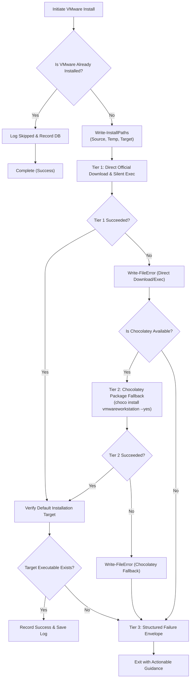

# 23-vmware-codex-claude-ui — 01: VMware Cross-Platform Installer Specification

> **Spec Version:** 1.0.0  
> **Status:** Active / Authoritative  
> **Domain:** Virtualization Infrastructure, Cross-Platform Automation & Installer Resilience  
> **Target Platforms:** Windows Server / Windows Desktop, Linux (Ubuntu / Debian)

---

## 1. User Request (Verbatim)

```text
# High Priority Instruction

can you please improve and fix VMware installation for Windows, Linux, and also can you please try to install Codex UI and Claude Code UI in the Windows Server, Linux Ubuntu, macOS? You test here in the Windows Server properly that Claude Code UI (not the CLI) gets installed properly and also the Codex. Do proper end-to-end testing during the process and install in the default installation directory, clear?

# Actionable Items Must Follow Non-Negotiable

1. Improve and fix VMware installation for Windows, Linux.
2. Install Codex UI and Claude Code UI on Windows Server, Linux Ubuntu, macOS.
3. Ensure Claude Code UI (not CLI) is installed properly on Windows Server.
4. Conduct proper end-to-end testing during the installation process.
5. Install all software in the default installation directory.

Must follow and spawn agent using 

@[.agents/skills/execute-parent-task-with-n-steps-v6]

## Additional Instructions

learn /learn if you have to learn something and /plan stuff before working please.
```

---

## 2. System Context & Architectural Objectives

This specification defines the multi-tier installation, verification, and resilient recovery architecture for **VMware Workstation Pro and VMware Workstation Player** across Windows and Linux environments.

The repository currently provides:
- Windows installer script: `scripts/66-install-vmware/run.ps1`
- Linux installer scripts: `scripts/os/ubuntu/install-vmware.sh`, `scripts/os/ubuntu/install-vmware-tools.sh`, `scripts/os/ubuntu/vmware-mount-shared.sh`

### Architectural Deficiencies Identified:
1. **Windows Installer Vulnerability**: Hardcoded direct download URL to VMware / Broadcom CDN can fail due to authentication gating or mirror changes, with zero fallback to package managers.
2. **Missing Multi-Tier Fallback**: No automatic graceful degradation from direct download to Chocolatey (`choco install vmwareworkstation --yes` or `choco install vmware-workstation-player --yes`).
3. **CODE RED Non-Compliance**: Lack of explicit `Write-InstallPaths` (Source, Temp, Target) invocation and incomplete `Write-FileError` structured error logging.
4. **Target Directory Ambiguity**: Failure to explicitly enforce and validate standard default installation directories across both 64-bit and 32-bit Program Files trees.
5. **Linux Kernel Header & Dependency Gaps**: Lack of automated verification for `build-essential` and matching `linux-headers-$(uname -r)` prior to bundle execution.

---

## 3. Standard Default Installation Directories

All VMware installers and verification routines MUST strictly target and validate the following standard default filesystem directories:

### 3.1 Windows Operating Systems
- **Primary 64-bit Default**:
  `${env:ProgramFiles(x86)}\VMware\VMware Workstation`
- **Alternative 64-bit Default**:
  `${env:ProgramFiles}\VMware\VMware Workstation`
- **Primary Binary Targets**:
  - `vmware.exe` (Workstation GUI)
  - `vmplayer.exe` (Player GUI)
  - `vmware-cmd.exe` (CLI management)
  - `vmrun.exe` (VIX automation interface)

### 3.2 Linux Operating Systems
- **Binary Directory**:
  `/usr/bin/vmware` and `/usr/bin/vmplayer`
- **Library & Modules Directory**:
  `/usr/lib/vmware`
- **Configuration Directory**:
  `/etc/vmware`
- **Shared Folder Mount Point**:
  `/mnt/hgfs`

---

## 4. Multi-Tier Resilient Installation Strategy

To ensure zero-downtime execution in automated CI/CD and production environments, the installer employs a 3-tier execution strategy:



### 4.1 Tier 1: Direct Binary Download & Silent Execution
1. Resolve direct download URL from `$env:VMWARE_DOWNLOAD_URL` or canonical fallback CDN URL.
2. Download installer executable or `.bundle` into isolated repository/OS temp folder.
3. Execute silent unattended installer with standard silent parameters:
   - **Windows**: `Start-Process -FilePath $tempFile -ArgumentList '/s /v"/qn EULAS_AGREED=1 AUTOSOFTWAREUPDATE=0 REBOOT=ReallySuppress"' -Wait -PassThru`
     - `/s`: Runs the setup bootstrap executable silently without displaying extraction dialogs.
     - `/v"..."`: Passes enclosed parameters directly to the underlying MSI database engine.
     - `/qn`: Full unattended silent execution with zero wizard user interface.
     - `EULAS_AGREED=1`: Broadcom automated license agreement flag, preventing blocking interactive acceptance dialogs.
     - `AUTOSOFTWAREUPDATE=0`: Disables phone-home check and automated software update polling.
     - `REBOOT=ReallySuppress`: Suppresses forced system reboots, ensuring provisioning scripts continue cleanly.
   - **Linux**: `sudo ./vmware-installer.bundle --console --required --eulas-agreed`
     - Automatically starts and enables virtualization services:
       `sudo systemctl enable --now vmware.service`
       `sudo systemctl enable --now vmware-USBArbitrator.service`

### 4.2 Tier 2: Chocolatey Fallback (Windows)
1. Detect presence of `choco.exe`. If missing, check if `Ensure-PackageManagers` or Chocolatey bootstrapping is enabled.
2. Execute automated silent install:
   `choco install vmwareworkstation --yes --no-progress`
3. If `vmwareworkstation` package is unavailable or fails, attempt secondary package:
   `choco install vmware-workstation-player --yes --no-progress`

### 4.3 Tier 3: Diagnostic Logging & Failure Envelopes
1. If both Tier 1 and Tier 2 fail, capture full diagnostic context (exit codes, downloaded file hashes, stderr).
2. Invoke `Write-FileError` (PowerShell) or `log_file_error` (Linux).
3. Record structured failure via `Invoke-DbRecord` / `db_record_failure`.

---

## 5. AGENTS.md CODE RED Standards Compliance

### 5.1 Mandatory Install-Paths Trio (`Write-InstallPaths`)
Before any network download, extraction, or binary execution occurs, the script MUST output and log the 3-path coordinates:

```powershell
Write-InstallPaths `
    -Tool   "VMware Workstation" `
    -Action "Install" `
    -Source $installerSource `
    -Temp   $tempInstallerPath `
    -Target $targetInstallDir
```

### 5.2 Mandatory File/Path Failure Logging (`Write-FileError`)
Every file download error, hash mismatch, corrupted installer, missing target directory, or permission failure MUST log the exact absolute path and raw reason:

```powershell
Write-FileError `
    -FilePath  $targetInstallDir `
    -Operation "ValidateInstall" `
    -Reason    "VMware binary not found in default target directory after installation completed" `
    -Module    "66-install-vmware"
```

On Linux systems, bash scripts MUST invoke `log_file_error`:
```bash
log_file_error "$target_path" "VMware binary missing at /usr/bin/vmware"
```

---

## 6. Coding Guidelines & Invariants

All modified and newly authored code MUST adhere to the following invariants:

1. **Strict Boolean Standards**:
   - Only `is*` and `has*` prefixes are permitted (`isInstalled`, `hasVMware`, `isChocoAvailable`, `hasBundle`).
   - Banned prefixes: `can`, `should`, `was`, or negative flags (`isNotInstalled`, `noVmware`).

2. **Micro-Functions**:
   - Target <= 8 lines of execution logic per function (maximum 15 lines).
   - Complex procedures must be decomposed into dedicated atomic helpers.

3. **Control Flow**:
   - Zero nested `if` statements.
   - Use guard clauses and early returns exclusively.

4. **Vertical Spacing**:
   - Mandatory blank lines before `if` statements.
   - Mandatory blank lines after closing `}`.
   - Mandatory blank lines before `return` statements.
   - Mandatory blank lines around multiline structures.

5. **Parameter Encapsulation**:
   - Banned loose >2-3 parameters; use structured parameter hashtables/objects.

---

## 7. Windows Script Specification (`scripts/66-install-vmware/run.ps1`)

### 7.1 Key Function Decomposition
- `Test-IsVMwareInstalled`: Inspects registry keys (`HKLM:\SOFTWARE\VMware, Inc.\VMware Workstation`, uninstall keys), default directory paths, and `VMAuthdService` status.
- `Get-VMwareCandidateDirs`: Resolves 64-bit and 32-bit Program Files candidate directory paths.
- `Get-VMwareTargetDir`: Resolves the active target directory for installation and logging.
- `Test-VMwareAuthService`: Verifies presence and registration of VMware Authorization Service (`VMAuthdService`).
- `Log-VMwareAuthServiceStatus`: Emits structured confirmation log when `VMAuthdService` is verified active.
- `Invoke-DirectInstall`: Downloads installer and executes silent unattended setup using unattended Broadcom MSI arguments.
- `Invoke-ChocoInstall`: Executes Chocolatey package installation fallback (`vmwareworkstation` then `vmware-workstation-player`).
- `Assert-VMwareInstalled`: Verifies executable presence in the default directory post-install.

### 7.2 Broadcom Unattended Arguments & VMAuthdService Verification
To guarantee zero-interaction unattended provisioning across Windows Server environments:
1. **Unattended Broadcom Silent MSI Arguments**:
   ```powershell
   $installerArgs = '/s /v"/qn EULAS_AGREED=1 AUTOSOFTWAREUPDATE=0 REBOOT=ReallySuppress"'
   $proc = Start-Process -FilePath $InstallerPath -ArgumentList $installerArgs -Wait -PassThru
   ```
   - `/s`: Suppresses outer bootstrap and self-extraction dialog windows.
   - `/v"..."`: Passes inner MSI flags directly to the Windows Installer engine.
   - `/qn`: Runs completely silent without user interface or progress wizard.
   - `EULAS_AGREED=1`: Pre-accepts Broadcom End User License Agreement to avoid interactive blocking prompts.
   - `AUTOSOFTWAREUPDATE=0`: Disables phone-home update telemetry and automated version polling.
   - `REBOOT=ReallySuppress`: Suppresses unplanned server restarts during automated orchestration.

2. **VMware Authorization Service (`VMAuthdService`) Verification**:
   The installer verifies core driver and service registration directly via PowerShell Service Manager:
   ```powershell
   function Test-VMwareAuthService {
       $service = Get-Service -Name "VMAuthdService" -ErrorAction SilentlyContinue
       $hasService = $null -ne $service

       return $hasService
   }
   ```
   Detecting `VMAuthdService` confirms that VMware core system drivers and background authentication hooks have successfully registered with the Windows Service Control Manager (SCM).

### 7.3 VMware Silent Uninstallation Lifecycle (`scripts/66-install-vmware/uninstall.ps1`)
To ensure clean removal and idempotency across CI/CD workers and test environments, `scripts/66-install-vmware/uninstall.ps1` implements a multi-tier silent uninstallation workflow:

1. **Service Teardown**:
   Prior to uninstallation, all active VMware services are stopped gracefully:
   - `VMAuthdService` (VMware Authorization Service)
   - `VMnetDHCP` (VMware Virtual Network DHCP Daemon)
   - `VMware NAT Service` (VMware Network Address Translation Daemon)
   - `VMUSBArbService` (VMware USB Arbitration Service)

2. **Registry Detection & Silent MSI Invocation**:
   Inspects standard 64-bit and 32-bit uninstall registries:
   - `HKLM:\SOFTWARE\Microsoft\Windows\CurrentVersion\Uninstall\*`
   - `HKLM:\SOFTWARE\WOW6432Node\Microsoft\Windows\CurrentVersion\Uninstall\*`
   Matches DisplayNames containing `VMware Workstation` or `VMware Player`, extracts the Product GUID, and executes silent uninstallation:
   ```powershell
   msiexec.exe /x "{PRODUCT-GUID}" /qn REBOOT=ReallySuppress /norestart
   ```

3. **Package Manager Uninstallation Fallbacks**:
   - Winget: `winget uninstall VMware.WorkstationPro --silent --accept-source-agreements`
   - Chocolatey: `choco uninstall vmwareworkstation --yes --remove-dependencies` (or `vmware-workstation-player`)

4. **Temp Artifacts Cleanup & CODE RED Audit**:
   - Removes any lingering installer bundles or executables: `%TEMP%\vmware-installer.exe`, `%TEMP%\vmware*.exe`, `%TEMP%\vmware*.bundle`.
   - Emits structured coordinates via `Write-InstallPaths -Action "Uninstall"`.
   - Logs failures with exact absolute path and error reason via `Write-FileError`.

### 7.4 Broadcom Personal Use License Mode Detection
VMware Workstation Pro 17.5.2+ and 17.6.0 are officially free for personal use under Broadcom licensing. The installer script detects and configures personal use mode via `Test-BroadcomPersonalUse`:
- Verifies `$env:VMWARE_PERSONAL_USE = "1"` or inspects `HKLM:\SOFTWARE\VMware, Inc.\VMware Workstation` for existing commercial serial keys.
- If no commercial license key is present, the script activates Broadcom Personal Use mode, suppressing licensing error gates and logging structured confirmation.
- Direct download mirrors prioritize official Broadcom CDN endpoints (17.6.0 build 24238078 and 17.5.2 build 23775571).

---

## 8. Linux Script Specification (`scripts/os/ubuntu/install-vmware.sh`)

### 8.1 Key Function Decomposition
- `is_vmware_installed`: Checks presence of `/usr/bin/vmware` and `/usr/lib/vmware`.
- `ensure_prerequisites`: Installs `build-essential`, `linux-headers-$(uname -r)`, and core compilation toolchains.
- `download_bundle`: Fetches the `.bundle` installer with fallback mirror rotation and checksum validation.
- `run_bundle_installer`: Executes `./vmware-installer.bundle --console --required --eulas-agreed`.
- `build_kernel_modules`: Executes `vmware-modconfig --console --install-all` to compile and link `vmmon` and `vmnet` kernel modules, with automatic community patch fallback.
- `fetch_community_patch` / `compile_community_patch`: Downloads and compiles `vmware-host-modules` headers for Linux kernels >= 6.5.
- `execute_vmware_setup`: Orchestrates bundle execution, kernel compilation, and systemd service startup.
- `validate_vmware_installation`: Verifies binaries `/usr/bin/vmware` and library root `/usr/lib/vmware`.

### 8.2 Ubuntu Systemd Service Startup & Daemon Management
Following kernel module compilation, the Ubuntu installation sequence ensures that all necessary background daemons are activated:
```bash
# Enable and immediately start core virtualization service (vmmon/vmnet bridge)
sudo systemctl enable --now vmware.service

# Enable and immediately start USB Arbitrator service for device passthrough
sudo systemctl enable --now vmware-USBArbitrator.service
```
- **`vmware.service`**: Activates core virtualization drivers, virtual network switches (`vmnet`), and networking NAT/DHCP daemons.
- **`vmware-USBArbitrator.service`**: Manages dynamic USB device arbitration and passthrough between host and guest virtual machines.
- **Service Verification**: Checks active state via `systemctl is-active --quiet vmware.service` and `systemctl is-active --quiet vmware-USBArbitrator.service`.

### 8.3 Modern Linux Kernel Module Compilation Fallback (Kernels >= 6.5)
On modern Linux kernels (kernel version >= 6.5, standard in Ubuntu 22.04.4 LTS and 24.04 LTS), stock `vmware-modconfig --console --install-all` can fail due to upstream kernel API changes in timer and memory subsystems.
To ensure zero compilation failures:
1. `build_kernel_modules` attempts stock `vmware-modconfig` first.
2. Upon failure, it invokes `build_community_modules` which:
   - Downloads the matching patch release from `https://github.com/mkubecek/vmware-host-modules/archive/refs/heads/workstation-${version}.tar.gz`.
   - Compiles patched `vmmon` and `vmnet` drivers cleanly against the running kernel headers.
   - Installs modules via `sudo make install`, updates module dependencies with `sudo depmod -a`, and loads drivers using `modprobe`.

---

## 9. Verification & Acceptance Criteria (15-Point Suite Integration)

1. **Path Integrity**: `Write-InstallPaths` fires with explicit Source, Temp, and Target coordinates.
2. **Directory Compliance**: Binary verified in `${env:ProgramFiles(x86)}\VMware\VMware Workstation` or `${env:ProgramFiles}\VMware\VMware Workstation` (Windows) and `/usr/bin/vmware` (Linux).
3. **Broadcom Silent Execution**: Unattended installer executes using `/s /v"/qn EULAS_AGREED=1 AUTOSOFTWAREUPDATE=0 REBOOT=ReallySuppress"` with zero interactive prompts.
4. **VMAuthdService Verification (Check 11)**: Windows installer verifies presence of `VMAuthdService` in the Windows Service Control Manager.
5. **Modern Kernel Compatibility**: Linux installer compiles kernel modules on Linux kernels >= 6.5 via stock `vmware-modconfig` or `vmware-host-modules` fallback.
6. **Ubuntu Systemd Service Startup**: Linux installer enables and starts `vmware.service` and `vmware-USBArbitrator.service` via `systemctl enable --now`.
7. **Fallback Verification**: Simulated broken direct download URL triggers Chocolatey fallback cleanly.
8. **Uninstall Lifecycle (Check 15)**: `scripts/66-install-vmware/uninstall.ps1` stops services, removes registry components silently, and purges temporary files.
9. **Log Recording**: Structured event recorded in SQLite tracking database (`package`, `vmware`, `17.x`).
10. **15-Point Live E2E Integration**: Validated as part of `tests/e2e-ai-ui-install.ps1` (Checks 1-2 for directory and version integrity, Check 11 for service auth, Check 15 for lifecycle).

