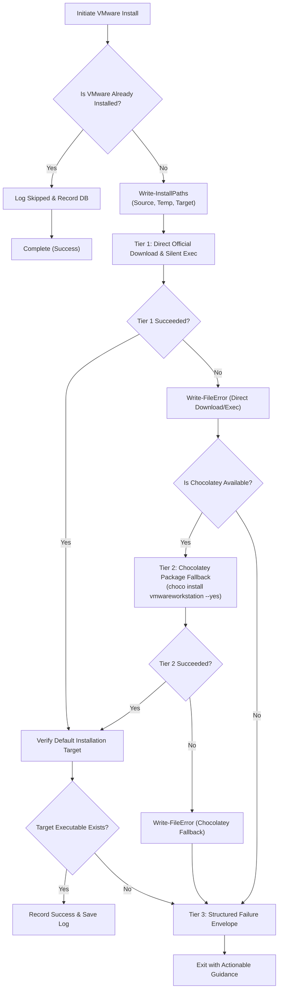

# 23-vmware-codex-claude-ui — 01: VMware Cross-Platform Installer Specification

> **Spec Version:** 1.0.0  
> **Status:** Active / Authoritative  
> **Domain:** Virtualization Infrastructure, Cross-Platform Automation & Installer Resilience  
> **Target Platforms:** Windows Server / Windows Desktop, Linux (Ubuntu / Debian)

---

## 1. User Request (Verbatim)

```text
# High Priority Instruction

can you please improve and fix VMware installation for Windows, Linux, and also can you please try to install Codex UI and Claude Code UI in the Windows Server, Linux Ubuntu, macOS? You test here in the Windows Server properly that Claude Code UI (not the CLI) gets installed properly and also the Codex. Do proper end-to-end testing during the process and install in the default installation directory, clear?

# Actionable Items Must Follow Non-Negotiable

1. Improve and fix VMware installation for Windows, Linux.
2. Install Codex UI and Claude Code UI on Windows Server, Linux Ubuntu, macOS.
3. Ensure Claude Code UI (not CLI) is installed properly on Windows Server.
4. Conduct proper end-to-end testing during the installation process.
5. Install all software in the default installation directory.

Must follow and spawn agent using 

@[.agents/skills/execute-parent-task-with-n-steps-v6]

## Additional Instructions

learn /learn if you have to learn something and /plan stuff before working please.
```

---

## 2. System Context & Architectural Objectives

This specification defines the multi-tier installation, verification, and resilient recovery architecture for **VMware Workstation Pro and VMware Workstation Player** across Windows and Linux environments.

The repository currently provides:
- Windows installer script: `scripts/66-install-vmware/run.ps1`
- Linux installer scripts: `scripts/os/ubuntu/install-vmware.sh`, `scripts/os/ubuntu/install-vmware-tools.sh`, `scripts/os/ubuntu/vmware-mount-shared.sh`

### Architectural Deficiencies Identified:
1. **Windows Installer Vulnerability**: Hardcoded direct download URL to VMware / Broadcom CDN can fail due to authentication gating or mirror changes, with zero fallback to package managers.
2. **Missing Multi-Tier Fallback**: No automatic graceful degradation from direct download to Chocolatey (`choco install vmwareworkstation --yes` or `choco install vmware-workstation-player --yes`).
3. **CODE RED Non-Compliance**: Lack of explicit `Write-InstallPaths` (Source, Temp, Target) invocation and incomplete `Write-FileError` structured error logging.
4. **Target Directory Ambiguity**: Failure to explicitly enforce and validate standard default installation directories across both 64-bit and 32-bit Program Files trees.
5. **Linux Kernel Header & Dependency Gaps**: Lack of automated verification for `build-essential` and matching `linux-headers-$(uname -r)` prior to bundle execution.

---

## 3. Standard Default Installation Directories

All VMware installers and verification routines MUST strictly target and validate the following standard default filesystem directories:

### 3.1 Windows Operating Systems
- **Primary 64-bit Default**:
  `${env:ProgramFiles(x86)}\VMware\VMware Workstation`
- **Alternative 64-bit Default**:
  `${env:ProgramFiles}\VMware\VMware Workstation`
- **Primary Binary Targets**:
  - `vmware.exe` (Workstation GUI)
  - `vmplayer.exe` (Player GUI)
  - `vmware-cmd.exe` (CLI management)
  - `vmrun.exe` (VIX automation interface)

### 3.2 Linux Operating Systems
- **Binary Directory**:
  `/usr/bin/vmware` and `/usr/bin/vmplayer`
- **Library & Modules Directory**:
  `/usr/lib/vmware`
- **Configuration Directory**:
  `/etc/vmware`
- **Shared Folder Mount Point**:
  `/mnt/hgfs`

---

## 4. Multi-Tier Resilient Installation Strategy

To ensure zero-downtime execution in automated CI/CD and production environments, the installer employs a 3-tier execution strategy:



### 4.1 Tier 1: Direct Binary Download & Silent Execution
1. Resolve direct download URL from `$env:VMWARE_DOWNLOAD_URL` or canonical fallback CDN URL.
2. Download installer executable or `.bundle` into isolated repository/OS temp folder.
3. Execute silent unattended installer with standard silent parameters:
   - **Windows**: `Start-Process -FilePath $tempFile -ArgumentList "/s /v`\"/qn REBOOT=ReallySuppress`\"" -Wait -PassThru`
   - **Linux**: `sudo ./vmware-installer.bundle --console --required --eulas-agreed`

### 4.2 Tier 2: Chocolatey Fallback (Windows)
1. Detect presence of `choco.exe`. If missing, check if `Ensure-PackageManagers` or Chocolatey bootstrapping is enabled.
2. Execute automated silent install:
   `choco install vmwareworkstation --yes --no-progress`
3. If `vmwareworkstation` package is unavailable or fails, attempt secondary package:
   `choco install vmware-workstation-player --yes --no-progress`

### 4.3 Tier 3: Diagnostic Logging & Failure Envelopes
1. If both Tier 1 and Tier 2 fail, capture full diagnostic context (exit codes, downloaded file hashes, stderr).
2. Invoke `Write-FileError` (PowerShell) or `log_file_error` (Linux).
3. Record structured failure via `Invoke-DbRecord` / `db_record_failure`.

---

## 5. AGENTS.md CODE RED Standards Compliance

### 5.1 Mandatory Install-Paths Trio (`Write-InstallPaths`)
Before any network download, extraction, or binary execution occurs, the script MUST output and log the 3-path coordinates:

```powershell
Write-InstallPaths `
    -Tool   "VMware Workstation" `
    -Action "Install" `
    -Source $installerSource `
    -Temp   $tempInstallerPath `
    -Target $targetInstallDir
```

### 5.2 Mandatory File/Path Failure Logging (`Write-FileError`)
Every file download error, hash mismatch, corrupted installer, missing target directory, or permission failure MUST log the exact absolute path and raw reason:

```powershell
Write-FileError `
    -FilePath  $targetInstallDir `
    -Operation "ValidateInstall" `
    -Reason    "VMware binary not found in default target directory after installation completed" `
    -Module    "66-install-vmware"
```

On Linux systems, bash scripts MUST invoke `log_file_error`:
```bash
log_file_error "$target_path" "VMware binary missing at /usr/bin/vmware"
```

---

## 6. Coding Guidelines & Invariants

All modified and newly authored code MUST adhere to the following invariants:

1. **Strict Boolean Standards**:
   - Only `is*` and `has*` prefixes are permitted (`isInstalled`, `hasVMware`, `isChocoAvailable`, `hasBundle`).
   - Banned prefixes: `can`, `should`, `was`, or negative flags (`isNotInstalled`, `noVmware`).

2. **Micro-Functions**:
   - Target <= 8 lines of execution logic per function (maximum 15 lines).
   - Complex procedures must be decomposed into dedicated atomic helpers.

3. **Control Flow**:
   - Zero nested `if` statements.
   - Use guard clauses and early returns exclusively.

4. **Vertical Spacing**:
   - Mandatory blank lines before `if` statements.
   - Mandatory blank lines after closing `}`.
   - Mandatory blank lines before `return` statements.
   - Mandatory blank lines around multiline structures.

5. **Parameter Encapsulation**:
   - Banned loose >2-3 parameters; use structured parameter hashtables/objects.

---

## 7. Windows Script Specification (`scripts/66-install-vmware/run.ps1`)

### 7.1 Key Function Decomposition
- `Test-IsVMwareInstalled`: Inspects registry keys (`HKLM:\SOFTWARE\VMware, Inc.\VMware Workstation`, uninstall keys) and default directory paths.
- `Get-VMwareDefaultDir`: Resolves the active or candidate Program Files path.
- `Invoke-DirectInstall`: Downloads installer and executes silent unattended setup.
- `Invoke-ChocoInstall`: Executes Chocolatey package installation fallback.
- `Assert-VMwareInstalled`: Verifies executable presence in the default directory post-install.

---

## 8. Linux Script Specification (`scripts/os/ubuntu/install-vmware.sh`)

### 8.1 Key Function Decomposition
- `is_vmware_installed`: Checks presence of `/usr/bin/vmware` and `/usr/lib/vmware`.
- `ensure_prerequisites`: Installs `build-essential`, `linux-headers-$(uname -r)`, and core compilation toolchains.
- `download_bundle`: Fetches the `.bundle` installer with checksum verification.
- `install_bundle`: Executes `./vmware-installer.bundle --console --required --eulas-agreed`.
- `configure_kernel_modules`: Executes `vmware-modconfig --console --install-all` if kernel modules require compilation.

---

## 9. Verification & Acceptance Criteria

1. **Path Integrity**: `Write-InstallPaths` fires with explicit Source, Temp, and Target.
2. **Directory Compliance**: Binary verified in `${env:ProgramFiles(x86)}\VMware\VMware Workstation` or `${env:ProgramFiles}\VMware\VMware Workstation` (Windows) and `/usr/bin/vmware` (Linux).
3. **Fallback Verification**: Simulated broken direct download URL triggers Chocolatey fallback cleanly.
4. **Log Recording**: Structured event recorded in SQLite tracking database (`package`, `vmware`, `17.x`).
