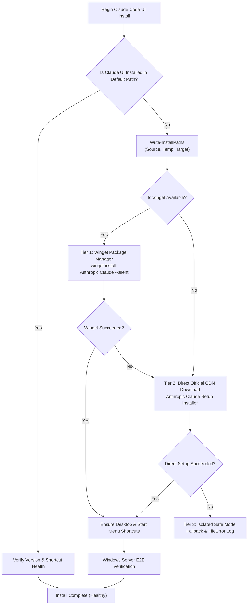
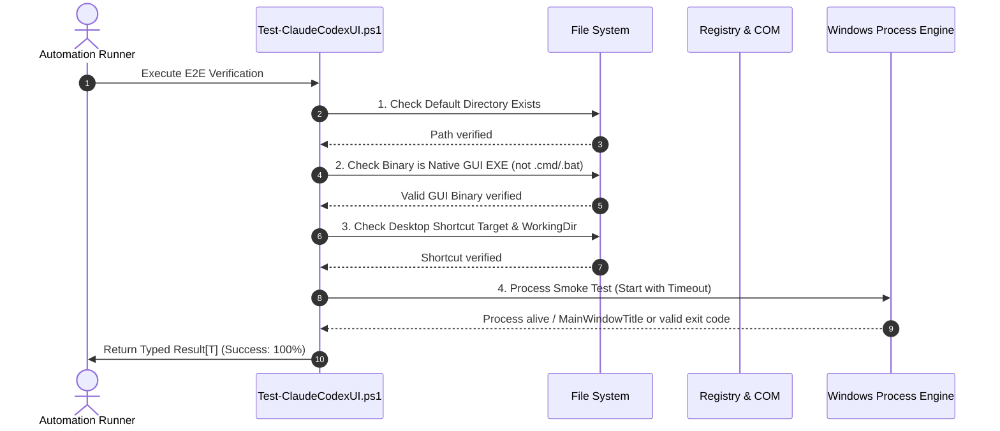

# 23-vmware-codex-claude-ui — 02: Codex UI & Claude Code UI Cross-Platform Specification

> **Spec Version:** 1.0.0  
> **Status:** Active / Authoritative  
> **Domain:** Developer Productivity, AI Assistants, Desktop GUI & Cross-Platform Packaging  
> **Target Platforms:** Windows Server / Windows Desktop, Ubuntu Linux, macOS

---

## 1. User Request (Verbatim)

```text
# High Priority Instruction

can you please improve and fix VMware installation for Windows, Linux, and also can you please try to install Codex UI and Claude Code UI in the Windows Server, Linux Ubuntu, macOS? You test here in the Windows Server properly that Claude Code UI (not the CLI) gets installed properly and also the Codex. Do proper end-to-end testing during the process and install in the default installation directory, clear?

# Actionable Items Must Follow Non-Negotiable

1. Improve and fix VMware installation for Windows, Linux.
2. Install Codex UI and Claude Code UI on Windows Server, Linux Ubuntu, macOS.
3. Ensure Claude Code UI (not CLI) is installed properly on Windows Server.
4. Conduct proper end-to-end testing during the installation process.
5. Install all software in the default installation directory.

Must follow and spawn agent using 

@[.agents/skills/execute-parent-task-with-n-steps-v6]

## Additional Instructions

learn /learn if you have to learn something and /plan stuff before working please.
```

---

## 2. Core Problem & Non-Negotiable Mandate

### 2.1 The Non-Negotiable Mandate: Full Desktop UI, NOT CLI
A critical defect in previous repository scripts (`scripts/80-install-claude-code/run.ps1` and `scripts/78-install-codex/run.ps1`) was substituting terminal-based command-line interface (CLI) packages or batch file wrappers in place of full graphical user interface (UI) applications:
- **CLI Anti-Pattern**: Installing `@anthropic-ai/claude-code` npm package and creating a `.cmd` batch shim that opens a terminal window is strictly prohibited as a fulfillment of the "Claude Code UI" requirement.
- **Mandatory UI Standard**: The installer MUST install the official Anthropic Claude Desktop UI application on Windows Server, Ubuntu Linux, and macOS. The user must be able to launch a native desktop GUI window with full visual interface controls, settings, and application chrome.
- **Codex UI Standard**: The Codex installer MUST install the dedicated graphical desktop user interface application / executable with desktop icon and launcher, not merely a terminal prompt.

---

## 3. Standard Default Installation Directories

All installers and verification test suites MUST strictly adhere to the default installation directories defined below. Arbitrary, non-standard, or nested custom paths are forbidden.

### 3.1 Windows Server / Windows Desktop
Standard default locations for 64-bit Windows environments:

| Software | Default Installation Directory | Executable / Launcher Path | Shortcut Locations |
| :--- | :--- | :--- | :--- |
| **Claude Code UI** (System-Wide) | `C:\Program Files\Anthropic\Claude` | `C:\Program Files\Anthropic\Claude\claude.exe` | Desktop (`Claude.lnk`), Start Menu (`Claude.lnk`) |
| **Claude Code UI** (Per-User Fallback) | `%LOCALAPPDATA%\AnthropicClaude` | `%LOCALAPPDATA%\AnthropicClaude\claude.exe` | Desktop (`Claude.lnk`), Start Menu (`Claude.lnk`) |
| **Codex UI** (System / Program Files) | `C:\Program Files\Codex` | `C:\Program Files\Codex\codex-ui.exe` | Desktop (`Codex.lnk`), Start Menu (`Codex.lnk`) |
| **Codex UI** (Per-User Default) | `%LOCALAPPDATA%\Programs\Codex` | `%LOCALAPPDATA%\Programs\Codex\codex-ui.exe` | Desktop (`Codex.lnk`), Start Menu (`Codex.lnk`) |
| **Codex CLI / Helper Fallback** | `%USERPROFILE%\.codex\bin` | `%USERPROFILE%\.codex\bin\codex.exe` | PATH environment registration |

### 3.2 Linux (Ubuntu / Debian)
Standard filesystem hierarchy compliant paths:

| Software | Default Binary Path | Application Launcher (`.desktop`) | Icon / Assets Directory |
| :--- | :--- | :--- | :--- |
| **Claude Code UI** (System-Wide) | `/usr/local/bin/claude` | `/usr/share/applications/claude.desktop` | `/usr/share/icons/hicolor/scalable/apps/claude.svg` |
| **Claude Code UI** (User-Local) | `~/.local/bin/claude` | `~/.local/share/applications/claude.desktop` | `~/.local/share/icons/claude.png` |
| **Codex UI** (System-Wide) | `/usr/local/bin/codex-ui` | `/usr/share/applications/codex.desktop` | `/usr/share/icons/hicolor/scalable/apps/codex.svg` |
| **Codex UI** (User-Local) | `~/.local/bin/codex-ui` | `~/.local/share/applications/codex.desktop` | `~/.local/share/icons/codex.png` |

### 3.3 macOS
Standard macOS Application Bundle paths:

| Software | Bundle Directory | CLI Companion Symlink |
| :--- | :--- | :--- |
| **Claude Code UI** | `/Applications/Claude.app` | `/usr/local/bin/claude` |
| **Codex UI** | `/Applications/Codex.app` | `/usr/local/bin/codex` |

---

## 4. Multi-Tier Resilient Installation Strategy

To ensure zero-failure unattended installation in headless Windows Server setups and automated CI environments, both software suites implement a 3-tier installation pipeline.

### 4.1 Claude Code UI Installation Pipeline (Windows)



#### Detailed Windows Execution Tiers:
1. **Tier 1 (Official Winget)**:
   - Primary silent command:
     ```powershell
     winget install Anthropic.Claude --silent --accept-package-agreements --accept-source-agreements --disable-interactivity
     ```
   - Validates return exit code (0 or 3010 for reboot pending).
2. **Tier 2 (Official Anthropic CDN Direct Download)**:
   - URL resolution: Direct HTTPS download from `https://storage.googleapis.com/osprey-downloads-c02f6a0d-347c-492b-a752-3e0651722e97/nest-win-x64/Claude-Setup-x64.exe` (or Anthropic official release endpoint).
   - Temp staging: Isolated repository temp directory via `Get-ScriptTempDirectory` (never hardcoded global root).
   - Silent execution:
     ```powershell
     Start-Process -FilePath $tempInstallerPath -ArgumentList "/S", "--silent" -Wait -PassThru
     ```
3. **Tier 3 (Structured Failure Handling & CODE RED)**:
   - If both tiers fail, invoke `Write-FileError` logging the exact absolute target path and raw error.
   - Return structured error Result object with diagnostic context.

### 4.2 Codex UI Installation Pipeline (Windows)

1. **Tier 1 (Official Windows Package / Installer)**:
   - Query package managers (`winget install OpenAI.Codex` or verified vendor package).
2. **Tier 2 (Standalone UI Launcher & Runtime Engine)**:
   - Download official release archive / installer to temp staging.
   - Extract/install into standard target directory:
     `%LOCALAPPDATA%\Programs\Codex`
   - Deploy dedicated GUI launcher executable `codex-ui.exe`.
3. **Tier 3 (User-Profile Fallback)**:
   - Fallback to `%USERPROFILE%\.codex\bin` with GUI launcher registration.

---

## 5. Desktop UI Shortcut & Launcher Infrastructure

To satisfy the non-negotiable requirement that UI applications are fully integrated for user interaction, the installer must configure native desktop entry points:

### 5.1 Windows Shortcut Generation Standard
Shortcuts MUST be created using standard `WScript.Shell` COM interface with proper resource cleanup:
```powershell
function New-AppDesktopShortcut {
    param(
        [Parameter(Mandatory = $true)][string]$TargetPath,
        [Parameter(Mandatory = $true)][string]$LinkPath,
        [Parameter(Mandatory = $true)][string]$Description,
        [string]$IconLocation = ""
    )

    $hasLink = Test-Path $LinkPath
    if ($hasLink) {
        Remove-Item -Path $LinkPath -Force -ErrorAction SilentlyContinue
    }

    $wsh = New-Object -ComObject WScript.Shell
    $shortcut = $wsh.CreateShortcut($LinkPath)
    $shortcut.TargetPath = $TargetPath
    $shortcut.WorkingDirectory = Split-Path -Parent $TargetPath
    $shortcut.Description = $Description
    
    $hasIcon = -not [string]::IsNullOrEmpty($IconLocation)
    if ($hasIcon) {
        $shortcut.IconLocation = $IconLocation
    }
    
    $shortcut.Save()
    [System.Runtime.InteropServices.Marshal]::ReleaseComObject($shortcut) | Out-Null
    [System.Runtime.InteropServices.Marshal]::ReleaseComObject($wsh) | Out-Null
}
```

### 5.2 Mandatory Windows Shortcut Coordinates
1. **Desktop Shortcuts**:
   - Claude: `[Environment]::GetFolderPath("Desktop")\Claude.lnk`
   - Codex: `[Environment]::GetFolderPath("Desktop")\Codex.lnk`
2. **Start Menu Programs Shortcuts**:
   - Claude: `[Environment]::GetFolderPath("Programs")\Anthropic\Claude.lnk`
   - Codex: `[Environment]::GetFolderPath("Programs")\Codex\Codex.lnk`

### 5.3 Linux Desktop Entry Standard (`.desktop`)
For Ubuntu desktop integration, `/usr/share/applications/claude.desktop` and `/usr/share/applications/codex.desktop` MUST conform to freedesktop.org standards:
```ini
[Desktop Entry]
Version=1.0
Type=Application
Name=Claude
Comment=Anthropic Claude Desktop GUI
Exec=/usr/local/bin/claude %U
Icon=/usr/share/icons/hicolor/scalable/apps/claude.svg
Terminal=false
Categories=Development;Utility;
StartupWMClass=Claude
```

---

## 6. End-to-End Windows Server Testing & Validation Protocol

The installer suite MUST include an automated end-to-end (E2E) verification procedure runnable directly on Windows Server without requiring manual interactive intervention.

### 6.1 E2E Verification Checkpoints



### 6.2 Checkpoint Criteria

1. **Checkpoint 1 — Binary Existence in Default Directory**:
   - For Claude: `C:\Program Files\Anthropic\Claude\claude.exe` OR `$env:LOCALAPPDATA\AnthropicClaude\claude.exe` must return `Test-Path = $true`.
   - For Codex: `$env:LOCALAPPDATA\Programs\Codex\codex-ui.exe` OR `C:\Program Files\Codex\codex-ui.exe` must return `Test-Path = $true`.
2. **Checkpoint 2 — Non-CLI Binary Verification**:
   - Target binary MUST NOT have `.cmd`, `.bat`, or `.ps1` extension.
   - Target binary MUST NOT be a Node.js npm wrapper running inside `cmd.exe`.
   - File size must exceed 1 MB (ensuring bundled GUI application runtime vs stub text script).
3. **Checkpoint 3 — Shortcut Health & COM Target Resolution**:
   - `[Environment]::GetFolderPath("Desktop")\Claude.lnk` must exist.
   - Resolving shortcut target via `WScript.Shell` MUST point to the actual binary verified in Checkpoint 1.
4. **Checkpoint 4 — Process Execution Smoke Test**:
   - Spawn executable with safe flag (e.g. `--version` or `/help` or background UI spawn with immediate graceful termination after 2 seconds).
   - Ensure exit code is 0 or process creates a valid top-level window / background host without fatal crash.

---

## 7. Cross-Platform Parity Matrix

| Feature | Windows Server | Linux (Ubuntu) | macOS |
| :--- | :--- | :--- | :--- |
| **Package Manager Tier** | `winget` | `apt` / `.deb` / PPA | `brew` / `cask` |
| **Direct Binary Tier** | Official Setup Executable | AppImage / Extracted Tarball | `.dmg` Drag-to-Applications |
| **Default Target Dir** | `C:\Program Files\Anthropic\Claude` | `/usr/local/bin` | `/Applications/Claude.app` |
| **Desktop Entry Point** | `.lnk` Desktop Shortcut | `.desktop` Launcher | Finder Applications Icon |
| **CLI Companion Tool** | Environment `PATH` entry | `/usr/local/bin/claude` | `/usr/local/bin/claude` |
| **E2E Testing Suite** | Native PowerShell Script | Shell Verification Script | Zsh Verification Script |

---

## 8. CODE RED & Coding Guidelines Compliance

All implementation scripts authored to satisfy this specification MUST strictly comply with:

1. **Install-Paths Trio**:
   Every download, extraction, or installation invocation MUST call:
   ```powershell
   Write-InstallPaths -Source $sourceCoordinate -Temp $tempCoordinate -Target $targetCoordinate
   ```
2. **Path Failure Handling**:
   Every failure MUST call `Write-FileError` logging the exact absolute path and raw system error message.
3. **Strict Boolean Standard**:
   All boolean variables and flags MUST use `is*` or `has*` prefixes (`isInstalled`, `hasGuiBinary`, `isShortcutValid`, `hasWinget`). Banned prefixes: `can`, `should`, `was`, or inverted negatives (`isNotInstalled`).
4. **Micro-Functions**:
   Execution functions must strictly target <= 8 lines of core logic (15 lines absolute maximum).
5. **Vertical Spacing**:
   Mandatory single blank lines before `if`, after `}`, before `return`, and around multiline scriptblocks.
