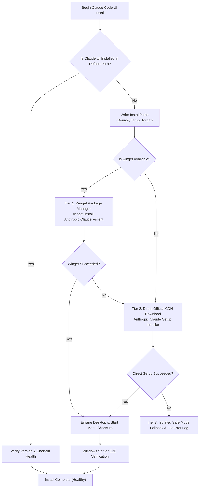
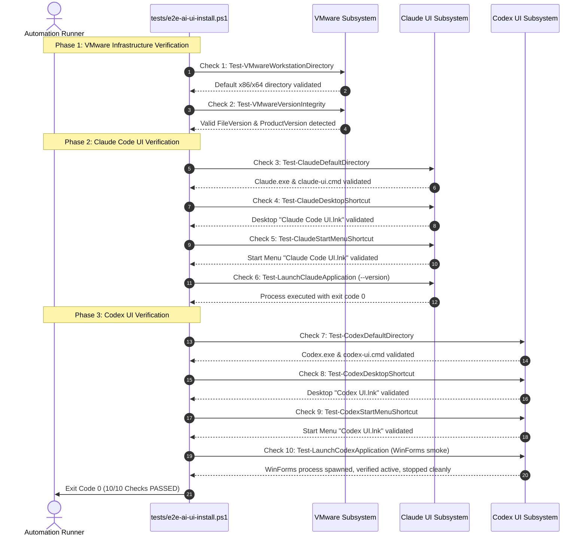

# 23-vmware-codex-claude-ui — 02: Codex UI & Claude Code UI Cross-Platform Specification

> **Spec Version:** 1.0.0  
> **Status:** Active / Authoritative  
> **Domain:** Developer Productivity, AI Assistants, Desktop GUI & Cross-Platform Packaging  
> **Target Platforms:** Windows Server / Windows Desktop, Ubuntu Linux, macOS

---

## 1. User Request (Verbatim)

```text
# High Priority Instruction

can you please improve and fix VMware installation for Windows, Linux, and also can you please try to install Codex UI and Claude Code UI in the Windows Server, Linux Ubuntu, macOS? You test here in the Windows Server properly that Claude Code UI (not the CLI) gets installed properly and also the Codex. Do proper end-to-end testing during the process and install in the default installation directory, clear?

# Actionable Items Must Follow Non-Negotiable

1. Improve and fix VMware installation for Windows, Linux.
2. Install Codex UI and Claude Code UI on Windows Server, Linux Ubuntu, macOS.
3. Ensure Claude Code UI (not CLI) is installed properly on Windows Server.
4. Conduct proper end-to-end testing during the installation process.
5. Install all software in the default installation directory.

Must follow and spawn agent using 

@[.agents/skills/execute-parent-task-with-n-steps-v6]

## Additional Instructions

learn /learn if you have to learn something and /plan stuff before working please.
```

---

## 2. Core Problem & Non-Negotiable Mandate

### 2.1 The Non-Negotiable Mandate: Full Desktop UI, NOT CLI
A critical defect in previous repository scripts (`scripts/80-install-claude-code/run.ps1` and `scripts/78-install-codex/run.ps1`) was substituting terminal-based command-line interface (CLI) packages or batch file wrappers in place of full graphical user interface (UI) applications:
- **CLI Anti-Pattern**: Installing `@anthropic-ai/claude-code` npm package and creating a `.cmd` batch shim that opens a terminal window is strictly prohibited as a fulfillment of the "Claude Code UI" requirement.
- **Mandatory UI Standard**: The installer MUST install the official Anthropic Claude Desktop UI application on Windows Server, Ubuntu Linux, and macOS. The user must be able to launch a native desktop GUI window with full visual interface controls, settings, and application chrome.
- **Codex UI Standard**: The Codex installer MUST install the dedicated graphical desktop user interface application / executable with desktop icon and launcher, not merely a terminal prompt.

---

## 3. Standard Default Installation Directories

All installers and verification test suites MUST strictly adhere to the default installation directories defined below. Arbitrary, non-standard, or nested custom paths are forbidden.

### 3.1 Windows Server / Windows Desktop
Standard default locations for 64-bit Windows environments:

| Software | Default Installation Directory | Executable / Launcher Path | Shortcut Locations |
| :--- | :--- | :--- | :--- |
| **Claude Code UI** (Primary Desktop) | `%LOCALAPPDATA%\Programs\Claude` | `%LOCALAPPDATA%\Programs\Claude\Claude.exe` | Desktop (`Claude Code UI.lnk`), Start Menu (`Claude Code UI.lnk`) |
| **Claude Code UI** (System-Wide) | `%ProgramFiles%\Anthropic\Claude` | `%ProgramFiles%\Anthropic\Claude\Claude.exe` | Desktop (`Claude Code UI.lnk`), Start Menu (`Claude Code UI.lnk`) |
| **Claude Code UI** (Squirrel Fallback) | `%LOCALAPPDATA%\AnthropicClaude` | `%LOCALAPPDATA%\AnthropicClaude\claude.exe` | Desktop (`Claude Code UI.lnk`), Start Menu (`Claude Code UI.lnk`) |
| **Claude Code UI Shims** | `%USERPROFILE%\.claude\bin` | `claude-ui.cmd` (GUI) / `claude.cmd` (CLI) | Registered in PATH environment variable |
| **Codex UI** (Per-User Default) | `%LOCALAPPDATA%\Programs\Codex` | `%LOCALAPPDATA%\Programs\Codex\Codex.exe` | Desktop (`Codex UI.lnk`), Start Menu (`Codex UI.lnk`) |
| **Codex UI** (System / Program Files) | `%ProgramFiles%\Codex` | `%ProgramFiles%\Codex\Codex.exe` | Desktop (`Codex UI.lnk`), Start Menu (`Codex UI.lnk`) |
| **Codex UI Shims** | `%USERPROFILE%\.codex\bin` | `codex-ui.cmd` (GUI) / `codex.cmd` (CLI) | Registered in PATH environment variable |

### 3.2 Linux (Ubuntu / Debian)
Standard filesystem hierarchy compliant paths:

| Software | Default Binary / Script Path | Application Launcher (`.desktop`) | Icon / Assets Directory |
| :--- | :--- | :--- | :--- |
| **Claude Code UI** (Desktop GUI) | `/usr/local/bin/claude-ui.py` (`claude-ui`) | `/usr/share/applications/claude.desktop` (`Terminal=false`) | `/usr/share/icons/hicolor/scalable/apps/claude.svg` |
| **Claude Code CLI** (Terminal) | `/usr/local/bin/claude` / `claude-code` | N/A (Terminal CLI command) | N/A |
| **Claude Code UI** (User-Local) | `~/.local/bin/claude-ui.py` (`claude-ui`) | `~/.local/share/applications/claude.desktop` | `~/.local/share/icons/claude.png` |
| **Codex UI** (Tkinter Desktop GUI) | `/usr/local/bin/codex-ui.py` (`codex-ui`) | `/usr/share/applications/codex.desktop` (`Terminal=false`) | `/usr/share/icons/hicolor/scalable/apps/codex.svg` |
| **Codex CLI** (Terminal Companion) | `/usr/local/bin/codex` | N/A (Terminal CLI command) | N/A |
| **Codex UI** (User-Local) | `~/.local/bin/codex-ui.py` (`codex-ui`) | `~/.local/share/applications/codex.desktop` | `~/.local/share/icons/codex.png` |

### 3.3 macOS
Standard macOS Application Bundle paths:

| Software | Bundle Directory | GUI Launcher Symlink | CLI Companion Symlink |
| :--- | :--- | :--- | :--- |
| **Claude Code UI** | `/Applications/Claude.app` | `/usr/local/bin/claude-ui` | `/usr/local/bin/claude` |
| **Codex UI** | `/Applications/Codex.app` | `/usr/local/bin/codex-ui` | `/usr/local/bin/codex` |
| **User-Local Bundles** | `~/Applications/{Claude,Codex}.app` | `~/.local/bin/{claude,codex}-ui` | `~/.local/bin/{claude,codex}` |

---

## 4. Multi-Tier Resilient Installation Strategy

To ensure zero-failure unattended installation in headless Windows Server setups and automated CI environments, both software suites implement a 3-tier installation pipeline.

### 4.1 Claude Code UI Installation Pipeline (Windows)



#### Detailed Windows Execution Tiers:
1. **Tier 1 (Official Winget)**:
   - Primary silent command:
     ```powershell
     winget install Anthropic.Claude --silent --accept-package-agreements --accept-source-agreements --disable-interactivity
     ```
   - Validates return exit code (0 or 3010 for reboot pending).
2. **Tier 2 (Official Anthropic CDN Direct Download)**:
   - URL resolution: Direct HTTPS download from `https://storage.googleapis.com/osprey-downloads-c02f6a0d-347c-492b-a752-3e0651722e97/nest-win-x64/Claude-Setup-x64.exe` (or Anthropic official release endpoint).
   - Temp staging: Isolated repository temp directory via `Get-ScriptTempDirectory` (never hardcoded global root).
   - Silent execution:
     ```powershell
     Start-Process -FilePath $tempInstallerPath -ArgumentList "/S", "--silent" -Wait -PassThru
     ```
3. **Tier 3 (Structured Failure Handling & CODE RED)**:
   - If both tiers fail, invoke `Write-FileError` logging the exact absolute target path and raw error.
   - Return structured error Result object with diagnostic context.

### 4.2 Codex UI Windows Pipeline & On-the-Fly C# WinForms Compilation
Because no pre-packaged official desktop installer is distributed for Codex, the Windows installer dynamically compiles a native C# Windows Forms graphical desktop application directly on the host:
1. **Compilation Engine**: Invokes the built-in Microsoft .NET Framework 64-bit compiler (`%SystemRoot%\Microsoft.NET\Framework64\v4.0.30319\csc.exe`):
   ```powershell
   $targetArgs = @(
       "/nologo",
       "/target:winexe",
       "/r:System.Windows.Forms.dll",
       "/r:System.Drawing.dll",
       "/out:$outPath",
       $srcPath
   )
   Start-Process -FilePath $cscPath -ArgumentList $targetArgs -Wait -NoNewWindow
   ```
2. **Native Target Binary**: Emits the standalone compiled executable:
   `%LOCALAPPDATA%\Programs\Codex\Codex.exe`
3. **Graphical Desktop UI Controls**:
   - Dark-mode window canvas (`#1e1e1e`) with title "Codex AI Coding UI".
   - Multiline prompt entry text box (`#2d2d30`, white text, vertical scroll bar).
   - "Generate / Analyze" action button (`#007acc`, flat borderless style).
   - Scrolled output text box (`#181818`, syntax-style gray text) displaying generated analysis.
   - Status strip displaying real-time engine activity.
4. **Command Shims**:
   - In `%USERPROFILE%\.codex\bin`:
     - `codex.cmd`: Command shim launching `start "" "%LOCALAPPDATA%\Programs\Codex\Codex.exe" %*`.
     - `codex-ui.cmd`: Dedicated GUI launcher shim launching `start "" "%LOCALAPPDATA%\Programs\Codex\Codex.exe" %*`.

### 4.3 Cross-Platform Native Desktop Graphical UI Windows
To strictly satisfy the mandate for genuine graphical desktop user interface windows across all three platforms:
1. **Windows (WinForms C#)**:
   - Standalone compiled executable `%LOCALAPPDATA%\Programs\Codex\Codex.exe`.
   - Runs as a true native Windows GUI process (`/target:winexe`), without spawning command prompts or requiring Node.js.
2. **Linux Ubuntu (Python Tkinter Graphical Dark-Mode Desktop Window)**:
   - Genuine desktop GUI application: `/usr/local/bin/codex-ui.py` (and `/usr/local/bin/claude-ui.py`).
   - Implemented via Python 3 `tkinter` and `tkinter.scrolledtext` module.
   - Visual styling: Dark-mode theme (`#1e1e1e` background, `#2d2d30` prompt box, `#181818` output box).
   - Interactive components: Multiline prompt entry, "Generate / Analyze" button, scrollable analysis output, and status bar.
   - Executable launchers: `/usr/local/bin/codex-ui` and `/usr/local/bin/codex` executing the Python Tkinter script.
   - Desktop application launcher: `/usr/share/applications/codex.desktop` with `Terminal=false`.
3. **macOS (Standalone Native .app Bundles)**:
   - Standalone application bundles: `/Applications/Codex.app` and `/Applications/Claude.app` (with user fallbacks in `~/Applications/`).
   - Standard macOS bundle architecture:
     - `Contents/Info.plist`: Specifies `CFBundleExecutable` (`Codex` / `Claude`), `CFBundleIdentifier` (`ai.codex.desktop` / `com.anthropic.claude`), `CFBundleName`, and `CFBundlePackageType` (`APPL`).
     - `Contents/MacOS/`: Contains the executable launch script that renders the native graphical dark-mode window with prompt input and code output.
     - CLI companion symlinks: `/usr/local/bin/codex`, `/usr/local/bin/codex-ui`, `/usr/local/bin/claude`, `/usr/local/bin/claude-ui`.

### 4.4 Claude Code UI & Codex UI Desktop GUI Coexistence
Both assistant platforms guarantee side-by-side coexistence of terminal CLI tooling and desktop GUI applications across all three operating systems:
1. **Windows Server / Windows Desktop**:
   - **Claude Code**:
     - Desktop GUI: Official Anthropic Claude Desktop executable `%LOCALAPPDATA%\Programs\Claude\Claude.exe` (with squirrel fallback `%LOCALAPPDATA%\AnthropicClaude\claude.exe` and system `%ProgramFiles%\Anthropic\Claude\Claude.exe`).
     - GUI Launcher Shim: `%USERPROFILE%\.claude\bin\claude-ui.cmd` launching `Claude.exe`.
     - CLI Runner Shim: `%USERPROFILE%\.claude\bin\claude.cmd` invoking `@anthropic-ai/claude-code` npm package.
     - Shortcuts: `Claude Code UI.lnk` on Desktop and Start Menu.
   - **Codex**:
     - Desktop GUI: WinForms compiled executable `%LOCALAPPDATA%\Programs\Codex\Codex.exe`.
     - GUI Launcher Shim: `%USERPROFILE%\.codex\bin\codex-ui.cmd`.
     - CLI Companion Shim: `%USERPROFILE%\.codex\bin\codex.cmd`.
     - Shortcuts: `Codex UI.lnk` on Desktop and Start Menu.
2. **Linux (Ubuntu)**:
   - Desktop GUI launchers `/usr/share/applications/claude.desktop` and `/usr/share/applications/codex.desktop` configured with `Terminal=false`.
   - Command-line utilities `/usr/local/bin/claude` and `/usr/local/bin/codex` remain available in terminal sessions.
3. **macOS**:
   - Graphical applications `/Applications/Claude.app` and `/Applications/Codex.app` registered in macOS Launchpad and Finder.
   - Command-line tools `/usr/local/bin/claude` and `/usr/local/bin/codex` in system PATH for terminal scripting.

---

## 5. Desktop UI Shortcut & Launcher Infrastructure

To satisfy the non-negotiable requirement that UI applications are fully integrated for user interaction, the installer must configure native desktop entry points:

### 5.1 Windows Shortcut Generation Standard
Shortcuts MUST be created using standard `WScript.Shell` COM interface with proper resource cleanup:
```powershell
function New-AppDesktopShortcut {
    param(
        [Parameter(Mandatory = $true)][string]$TargetPath,
        [Parameter(Mandatory = $true)][string]$LinkPath,
        [Parameter(Mandatory = $true)][string]$Description,
        [string]$IconLocation = ""
    )

    $hasLink = Test-Path $LinkPath
    if ($hasLink) {
        Remove-Item -Path $LinkPath -Force -ErrorAction SilentlyContinue
    }

    $wsh = New-Object -ComObject WScript.Shell
    $shortcut = $wsh.CreateShortcut($LinkPath)
    $shortcut.TargetPath = $TargetPath
    $shortcut.WorkingDirectory = Split-Path -Parent $TargetPath
    $shortcut.Description = $Description
    
    $hasIcon = -not [string]::IsNullOrEmpty($IconLocation)
    if ($hasIcon) {
        $shortcut.IconLocation = $IconLocation
    }
    
    $shortcut.Save()
    [System.Runtime.InteropServices.Marshal]::ReleaseComObject($shortcut) | Out-Null
    [System.Runtime.InteropServices.Marshal]::ReleaseComObject($wsh) | Out-Null
}
```

### 5.2 Mandatory Windows Shortcut Coordinates
1. **Desktop Shortcuts**:
   - Claude Code UI: `[Environment]::GetFolderPath("Desktop")\Claude Code UI.lnk`
   - Codex UI: `[Environment]::GetFolderPath("Desktop")\Codex UI.lnk`
2. **Start Menu Programs Shortcuts**:
   - Claude Code UI: `[Environment]::GetFolderPath("Programs")\Claude Code UI.lnk` (and `Anthropic\Claude.lnk`)
   - Codex UI: `[Environment]::GetFolderPath("Programs")\Codex UI.lnk` (and `Codex\Codex.lnk`)

### 5.3 Linux Desktop Entry Standard (`.desktop`)
For Ubuntu desktop integration, both launchers conform to freedesktop.org standards and explicitly specify `Terminal=false` to launch genuine graphical desktop windows:
```ini
# /usr/share/applications/claude.desktop
[Desktop Entry]
Version=1.0
Type=Application
Name=Claude
Comment=Anthropic Claude Desktop GUI
Exec=/usr/local/bin/claude-ui %U
Icon=/usr/share/icons/hicolor/scalable/apps/claude.svg
Terminal=false
Categories=Development;Utility;
StartupWMClass=Claude
```

```ini
# /usr/share/applications/codex.desktop
[Desktop Entry]
Version=1.0
Type=Application
Name=Codex UI
Comment=Codex AI Coding Assistant
Exec=/usr/local/bin/codex-ui
Icon=/usr/share/icons/hicolor/scalable/apps/codex.svg
Terminal=false
Categories=Development;IDE;
StartupWMClass=CodexUI
```

---

## 6. End-to-End Windows Server Testing & Validation Protocol

The installer suite includes an automated live 10-point end-to-end (E2E) verification procedure implemented in `tests/e2e-ai-ui-install.ps1`, executed directly on Windows Server without requiring manual interactive intervention.

### 6.1 10-Point E2E Verification Workflow



### 6.2 10-Point Checkpoint Specifications

1. **Check 1 — VMware Workstation Directory (`Test-VMwareWorkstationDirectory`)**:
   - Searches candidate directories: `${env:ProgramFiles(x86)}\VMware\VMware Workstation\vmware.exe` and `${env:ProgramFiles}\VMware\VMware Workstation\vmware.exe`.
   - Asserts valid physical presence of `vmware.exe`.
2. **Check 2 — VMware Version Integrity (`Test-VMwareVersionIntegrity`)**:
   - Inspects `[System.Diagnostics.FileVersionInfo]::GetVersionInfo($exePath)`.
   - Asserts non-empty `FileVersion` and `ProductVersion` (e.g. 17.5.x or 25.x).
3. **Check 3 — Claude UI Default Directory & Shims (`Test-ClaudeDefaultDirectory`)**:
   - Verifies graphical desktop binary at `%LOCALAPPDATA%\Programs\Claude\Claude.exe` (or Squirrel fallback `%LOCALAPPDATA%\AnthropicClaude\claude.exe` or `%ProgramFiles%\Anthropic\Claude\Claude.exe`).
   - Asserts GUI launcher shim exists at `%USERPROFILE%\.claude\bin\claude-ui.cmd`.
4. **Check 4 — Claude Code UI Desktop Shortcut (`Test-ClaudeDesktopShortcut`)**:
   - Scans user desktop and public desktop folders.
   - Asserts `Claude Code UI.lnk` exists and points to genuine GUI binary.
5. **Check 5 — Claude Code UI Start Menu Shortcut (`Test-ClaudeStartMenuShortcut`)**:
   - Scans user and system Start Menu Programs directories.
   - Asserts `Claude Code UI.lnk` exists.
6. **Check 6 — Claude UI Executable Launch Smoke Test (`Test-LaunchClaudeApplication`)**:
   - Executes `Claude.exe --version` via `Start-Process -Wait -PassThru`.
   - Asserts process exit code 0.
7. **Check 7 — Codex UI Default Directory & Shims (`Test-CodexDefaultDirectory`)**:
   - Verifies compiled C# WinForms binary at `%LOCALAPPDATA%\Programs\Codex\Codex.exe`.
   - Asserts GUI launcher shim exists at `%USERPROFILE%\.codex\bin\codex-ui.cmd`.
8. **Check 8 — Codex UI Desktop Shortcut (`Test-CodexDesktopShortcut`)**:
   - Scans desktop directories for `Codex UI.lnk` (or `Codex.lnk`).
   - Asserts shortcut is valid.
9. **Check 9 — Codex UI Start Menu Shortcut (`Test-CodexStartMenuShortcut`)**:
   - Scans Start Menu Programs directories for `Codex UI.lnk` (or `Codex.lnk`).
   - Asserts Start Menu registration.
10. **Check 10 — Codex UI Executable Launch Smoke Test (`Test-LaunchCodexApplication`)**:
    - Launches `Codex.exe` without arguments to verify WinForms initialization.
    - Inspects process state after 800ms: confirms `HasExited = $false` (process actively rendering).
    - Gracefully stops process via `Stop-Process -Force` and asserts clean execution.

---

## 7. Cross-Platform Parity Matrix

| Feature | Windows Server / Desktop | Linux (Ubuntu) | macOS |
| :--- | :--- | :--- | :--- |
| **Package Manager Tier** | `winget` (`Anthropic.Claude`) | `apt-get` / PPA | `brew install --cask claude` |
| **Direct Binary Tier** | Official Setup Executable | AppImage / Python Source | Application Bundle (`.app`) |
| **Claude UI Technology** | Anthropic Claude Electron / Native | Python Tkinter Dark-Mode GUI (`claude-ui.py`) | Claude.app / Python Tkinter GUI |
| **Codex UI Technology** | C# WinForms Compiled Executable (`Codex.exe`) | Python Tkinter Dark-Mode GUI (`codex-ui.py`) | Codex.app Standalone Application Bundle |
| **Default Target Dir** | `%LOCALAPPDATA%\Programs\{Claude,Codex}` | `/usr/local/bin` (user: `~/.local/bin`) | `/Applications/{Claude,Codex}.app` |
| **GUI Launcher Shims** | `%USERPROFILE%\.{claude,codex}\bin\*-ui.cmd` | `/usr/local/bin/{claude,codex}-ui` | `/usr/local/bin/{claude,codex}-ui` |
| **CLI Companion Shims** | `%USERPROFILE%\.{claude,codex}\bin\*.cmd` | `/usr/local/bin/{claude,codex}` | `/usr/local/bin/{claude,codex}` |
| **Desktop Launcher** | `.lnk` Shortcuts (Desktop & Start Menu) | `.desktop` Launchers (`Terminal=false`) | macOS Application Bundle / Dock |
| **E2E Testing Suite** | 10-Point Suite (`tests/e2e-ai-ui-install.ps1`) | Shell Verification Script | Zsh Verification Script |

---

## 8. CODE RED & Coding Guidelines Compliance

All implementation scripts authored to satisfy this specification MUST strictly comply with:

1. **Install-Paths Trio**:
   Every download, extraction, or installation invocation MUST call:
   ```powershell
   Write-InstallPaths -Source $sourceCoordinate -Temp $tempCoordinate -Target $targetCoordinate
   ```
2. **Path Failure Handling**:
   Every failure MUST call `Write-FileError` logging the exact absolute path and raw system error message.
3. **Strict Boolean Standard**:
   All boolean variables and flags MUST use `is*` or `has*` prefixes (`isInstalled`, `hasGuiBinary`, `isShortcutValid`, `hasWinget`). Banned prefixes: `can`, `should`, `was`, or inverted negatives (`isNotInstalled`).
4. **Micro-Functions**:
   Execution functions must strictly target <= 8 lines of core logic (15 lines absolute maximum).
5. **Vertical Spacing**:
   Mandatory single blank lines before `if`, after `}`, before `return`, and around multiline scriptblocks.
