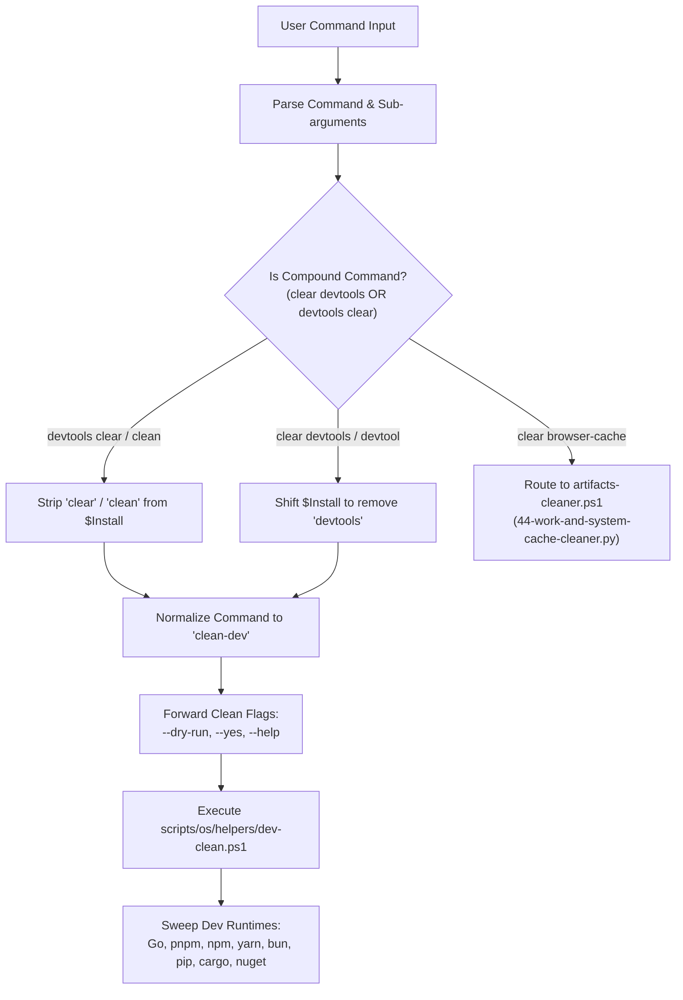

# 24-vmware-clear-help-codex-plot — 01: Clear Commands Harmonization, Subcommand Help Routing & StrictMode Fix Specification

> **Spec Version:** 1.0.0  
> **Status:** Active / Authoritative  
> **Domain:** Command Dispatch, CLI Architecture, Cross-Platform Shells, System Maintenance  
> **Target Platforms:** Windows 10/11, Windows Server 2016-2025, Ubuntu Linux, macOS  
> **Target Release:** v1.56.0  

---

## 1. Executive Summary & Problem Statement

This specification defines the architectural requirements, design patterns, command normalization protocols, and remediation procedures for five critical command-dispatch subsystems in `scripts-fixer`:

1. **Clear Commands Harmonization (`devtools clear` and `clear devtools`)**: Resolving a routing asymmetry where `devtools clear` and `clear devtools` take divergent execution branches across Windows PowerShell (`run.ps1`) and Linux Bash (`scripts-linux/run.sh`), leaving dangling verb arguments and conflating developer toolchain cache cleaning (`clean-dev`) with browser DevTools cache purging (`artifacts-cleaner.ps1`).
2. **PowerShell StrictMode Remediation for `dev-clean.ps1:391`**: Eliminating terminating null-reference exceptions under `Set-StrictMode -Version Latest` when querying stale build and editor cache files in `Invoke-StaleBuildArtifactsSweep`.
3. **Dedicated GitMap Subcommand Help Screen (`scripts/dispatcher/help/gitmap-help.ps1`)**: Authoring a modular, theme-compliant GitMap help renderer displaying all high-performance automation (`aum`), search, pipeline self-healing, LLM onboarding, and fast commit capabilities.
4. **Early Help Interceptor Bypass (`scripts/dispatcher/early-help.ps1`)**: Exempting the `gitmap` command family from the root dispatcher's early help interceptor so that `gitmap -h`, `gitmap --help`, and `gitmap help` deliver targeted GitMap documentation instead of being hijacked by global root help.
5. **GitMap Subcommand Dispatch Architecture**: Adding first-class `gitmap` command routing across both PowerShell (`run.ps1`) and Bash (`scripts-linux/run.sh`), providing automatic binary resolution, graceful installation prompts when absent, and seamless argument forwarding.
6. **Linux OS Help Routing & Machine Alias Protection (`scripts-linux/run.sh`)**: Remediating a severe defect where running `./run.sh os help` executes `machine-info.sh "help"` as an implicit rename operation, mutating the host machine alias to `"help"`.

---

## 2. Clear Commands Harmonization Specification

### 2.1 The Divergence & Conflict in Existing Dispatchers

Currently, running clean commands exhibits severe inconsistencies depending on the syntax ordering:

```
[Invocations]
  1. .\run.ps1 devtools clear       --> Routed via lines 644-648 to 'clean-dev' with dangling $Install = @("clear")
  2. .\run.ps1 clear devtools       --> Intercepted by line 525, falls through to line 537 (artifacts-cleaner.ps1 devtools)
  3. ./run.sh devtools clear        --> Shifted at line 104 to osclean-passthrough (--only pkg-npm,pkg-pnpm,...)
  4. ./run.sh clear devtools        --> Shifted at line 107 to osclean-passthrough (--only pkg-npm,pkg-pnpm,...)
```

#### Root-Cause Breakdown in `run.ps1`:
1. **Line 525 vs Line 537 Disparity**:
   - In `run.ps1`, line 525 checks:
     `if ($normalizedCommand -in @('clean','clear') -and $Install -and $Install.Count -ge 1)`
   - Line 527 matches:
     `if ($firstCleanArg -in @('dev','devs','developer','devtool','dev-tool','dev-tools','dev-tools-cache','dev-clean','clean-dev','devtool-cache'))`
   - Notice that `'devtool'` is present, but `'devtools'` is missing!
   - Consequently, `'devtools'` falls through to line 537:
     `elseif ($firstCleanArg -in @(..., 'devtools', 'devtools-cache', ...))`
   - Line 537 routes to `scripts\os\helpers\artifacts-cleaner.ps1 devtools`, which cleans Browser DevTools and GPU caches via `44-work-and-system-cache-cleaner.py`.
2. **Dangling Verb Argument in `devtools clear`**:
   - When the user runs `.\run.ps1 devtools clear`, `$normalizedCommand` is `"devtools"`, and `$Install` is `@("clear")`.
   - Lines 644-648 rewrite `$commandAliasMap["devtools"] = "clean-dev"`.
   - However, `$Install` is NOT shifted or stripped of the `"clear"` verb!
   - When `$isBareCleanDevCommand` executes, it builds `$osArgs = @("dev-cleanup") + @($Install)`, resulting in `@("dev-cleanup", "clear")`.
   - `scripts/os/helpers/dev-clean.ps1` receives `$Argv` with `"clear"`, which is an unexpected positional parameter.

### 2.2 Desired Harmonization Contract

1. **Top-Level Intent Harmonization**:
   - `devtools clear`, `clear devtools`, `devtool clear`, `clear devtool`, `clean devtools`, and `devtools clean` MUST all resolve to the developer tools cache cleaner (`clean-dev` / `dev-cleanup`).
   - If the user specifically intends to purge Browser DevTools & GPU caches, the unambiguous syntax `clean browser-cache` / `clear browser-cache` or `clean devtools-browser` MUST be used.
2. **Verb Argument Stripping**:
   - When a compound command like `devtools clear` or `terminal clear` is dispatched, the redundant verb (`clear`, `clean`, `cleanup`, `reset`, `purge`) MUST be stripped from `$Install` so that only operational flags (such as `--dry-run`, `-y`, `--yes`) are forwarded to the child script.
3. **Cross-Platform Parity**:
   - Windows PowerShell (`run.ps1`) and Linux Bash (`scripts-linux/run.sh`) MUST execute identical cleaning actions: sweeping developer package caches (Go, npm, pnpm, yarn, bun, pip, cargo, nuget, gradle, maven).

### 2.3 Clear Dispatch Flowchart



---

## 3. StrictMode Remediation for `scripts/os/helpers/dev-clean.ps1`

### 3.1 Problem Analysis

In `scripts/os/helpers/dev-clean.ps1`, line 31 enables the strictest PowerShell engine validation:
```powershell
Set-StrictMode -Version Latest
```

Under `Set-StrictMode -Version Latest`, referencing a property on `$null` or evaluating `.Count` on an uninitialized/scalar variable throws a terminating exception:
```
The property 'Count' cannot be found on this object. Verify that the property exists.
```

At lines 387-396:
```powershell
function Invoke-StaleBuildArtifactsSweep {
    param([bool]$IsDryMode)

    $staleFiles = Get-StaleDevCacheFiles
    $hasFiles = $staleFiles.Count -gt 0

    if (-not $hasFiles) {
        return
    }
...
```

If `Get-StaleDevCacheFiles` finds no matching files, it returns `$null` (or an empty pipeline output). Directly accessing `$staleFiles.Count` causes an immediate terminating failure during `.\run.ps1 clean-dev` or `.\run.ps1 os dev-cleanup`.

### 3.2 Remediation Protocol

To ensure mathematical certainty and strict adherence to repository coding rules:
1. Wrap `$staleFiles` in an explicit array subexpression `@(...)` before accessing `.Count`.
2. Apply affirmative boolean naming:
   ```powershell
   $staleFiles = Get-StaleDevCacheFiles
   $hasFiles = @($staleFiles).Count -gt 0

   if (-not $hasFiles) {
       return
   }
   ```
3. This guarantees that whether `Get-StaleDevCacheFiles` returns `$null`, a single `FileInfo` object (scalar), or an array of objects, `@($staleFiles)` always evaluates to a valid `[object[]]` array whose `.Count` is safely queryable (`0`, `1`, or `N`).

---

## 4. Subcommand Help Routing & GitMap Dispatcher Architecture

### 4.1 The Early Help Interceptor Problem

The root PowerShell dispatcher loads `scripts/dispatcher/early-help.ps1` to handle early command-line queries like `.\run.ps1 help` or `.\run.ps1 -h` before git-pull or child script dispatching occurs.

In `scripts/dispatcher/early-help.ps1`:
```powershell
    } elseif (($Help -or $h) -and -not $I -and ($_cmdLow -notin @("nginx", "os", "ssh", "menu", "vscode-folder", "git-tools", "agy", "antigravity", "clean-agy", "clear-agy", "clean-dev", "dev-clean", "dev-cleanup", "cleandev", "devcleanup"))) {
        $_isEarlyHelp = $true
        ...
```

#### The Bug:
- The exclusion list `@("nginx", "os", "ssh", ...)` defines subcommands that possess their own dedicated help screens and MUST NOT be intercepted by the global help search.
- `"gitmap"` is NOT in this exclusion array!
- When a developer runs:
  ```powershell
  .\run.ps1 gitmap -h
  .\run.ps1 gitmap --help
  ```
  `Invoke-EarlyHelpIntercept` intercepts execution, sets `$_earlyHelpFilter = "gitmap"`, and renders the entire root help catalog filtered by the word `"gitmap"`, exiting immediately (`exit 0`).
- The developer NEVER reaches the dedicated GitMap CLI help.

### 4.2 Early Help Interceptor Remediation

1. **Exemption Array Update**:
   Add `"gitmap"` to the `-notin` exclusion list in `scripts/dispatcher/early-help.ps1:184`:
   ```powershell
   @("nginx", "os", "ssh", "menu", "vscode-folder", "git-tools", "agy", "antigravity", "clean-agy", "clear-agy", "clean-dev", "dev-clean", "dev-cleanup", "cleandev", "devcleanup", "gitmap")
   ```
2. **Completion Pool Update**:
   Add `'gitmap'` to the interactive autocomplete pool `$_completionPool` in `scripts/dispatcher/early-help.ps1:416-427` to support Tab completion in interactive help mode.

### 4.3 GitMap Help Screen Architecture (`scripts/dispatcher/help/gitmap-help.ps1`)

Create `scripts/dispatcher/help/gitmap-help.ps1` adhering strictly to repository rules:
- **Micro-functions**: Decomposed into functions targeting $\le 8$ lines of execution logic (max 15 lines).
- **Affirmative booleans**: `is*` and `has*` prefixes only.
- **Vertical spacing**: Mandatory blank lines before `if`, after `}`, before `return`.
- **Theming**: Consistently using `$ThemePrimary`, `$ThemeSecondary`, `$ThemeAccent`, `$ThemeMuted`, `$ThemeError`.

#### Function Decomposition:
1. `Show-GitmapHelpHeader`:
   Displays title banner, version, author (MD ALIM UL KARIM), and sponsor attribution (RISEUP ASIA LLC).
2. `Show-GitmapHelpAutomationActions`:
   Displays high-performance AUM automation commands (`aum search` / `aum grep`, `aum guard`, `aum sequence`, `aum locate`, `aum newlines`).
3. `Show-GitmapHelpSearchAndCommitActions`:
   Displays instant symbol search (`search`), fast file discovery (`ff`, `ffa`, `ffs`, `ffe`), and semantic commit shortcuts (`cpf`, `cpb`, `cpr`, `pcp`).
4. `Show-GitmapHelpPipelineAndLlmActions`:
   Displays CI/CD pipeline self-healing (`pipeline-ai status`, `pipeline error-logs`, `pipeline purge`), and LLM onboarding (`llm train`, `llm-docs`, `llm`).
5. `Show-GitmapHelpClusterAndRunners`:
   Displays cluster orchestration (`cluster`), SSH pooling (`ssh`), and cross-platform runners (`pwsh`, `bash`, `pae`).
6. `Show-GitmapHelp`:
   Composite root function orchestrating the sections.

### 4.4 GitMap Dispatch Routing in `run.ps1`

In `run.ps1`:
1. Dot-source `scripts/dispatcher/help/gitmap-help.ps1` via `scripts/dispatcher/root-help.ps1`.
2. Register `$isBareGitmapCommand = $normalizedCommand -eq "gitmap"`.
3. Include `$isBareGitmapCommand` in `$isDispatchingBareSubcommand` and `$isReadOnlyBare` (when help is requested).
4. Implement the execution block:
   ```powershell
   if ($isBareGitmapCommand) {
       Show-VersionHeader
       $gitmapArgs = @()
       if ($null -ne $Install) { $gitmapArgs = @($Install) }

       $isHelp = ($h -or $Help -or ($gitmapArgs.Count -eq 0) -or `
           ($gitmapArgs[0].ToLower() -in @("help", "--help", "-help", "-h", "/?", "?")))

       if ($isHelp) {
           Show-GitmapHelp
           exit 0
       }

       $gitmapExe = Get-Command "gitmap" -ErrorAction SilentlyContinue
       $isInstalled = $null -ne $gitmapExe

       if (-not $isInstalled) {
           $defaultExe = "C:\dev-tool\GitMap\gitmap.exe"
           if (Test-Path $defaultExe) {
               $isInstalled = $true
               $gitmapExe = $defaultExe
           }
       }

       if ($isInstalled) {
           & $gitmapExe @gitmapArgs
           exit $LASTEXITCODE
       }

       Write-Host "  [ NOTE ] GitMap CLI is not yet installed." -ForegroundColor $ThemeAccent
       Write-Host "  Install via: .\run.ps1 install gitmap   or   .\run.ps1 -I 35" -ForegroundColor White
       exit 1
   }
   ```

### 4.5 GitMap Dispatch Routing in `scripts-linux/run.sh`

In `scripts-linux/run.sh`:
1. Add `gitmap)` to the top-level CLI argument parsing `case "$1" in`:
   ```bash
   gitmap)
       VERB="gitmap-passthrough"; shift; GITMAP_REST=("$@"); break ;;
   ```
2. In the execution dispatch switch:
   ```bash
   gitmap-passthrough)
       _gm_sub="${GITMAP_REST[0]:-help}"
       if [ "$_gm_sub" = "help" ] || [ "$_gm_sub" = "-h" ] || [ "$_gm_sub" = "--help" ] || [ ${#GITMAP_REST[@]} -eq 0 ]; then
           show_gitmap_help
           exit 0
       fi
       if command -v gitmap >/dev/null 2>&1; then
           gitmap "${GITMAP_REST[@]}"
           exit $?
       fi
       printf "\n\033[33m  [ NOTE ] GitMap CLI is not installed.\033[0m\n"
       printf "  Install via: curl -fsSL https://raw.githubusercontent.com/alimtvnetwork/gitmap-v28/main/install.sh | sh\n"
       printf "  Or run:      ./run.sh install gitmap\n\n"
       exit 1
       ;;
   ```
3. Implement `show_gitmap_help` in `scripts-linux/run.sh` outputting clear, formatted GitMap CLI subcommands matching the PowerShell parity standard.

---

## 5. Linux OS Help Routing & Machine Alias Remediation

### 5.1 Problem Analysis

In `scripts-linux/run.sh`, lines 61-80 handle the `os` command:
```bash
    os)
        if [ "${2:-}" = "clear-terminal" ] || [ "${2:-}" = "terminal-clear" ]; then
            VERB="clear-terminal-passthrough"; shift 2; CLRTERM_REST=("$@"); break
        fi
        if [ "${2:-}" = "terminal" ] && { [ "${3:-}" = "clear" ] || [ "${3:-}" = "clean" ]; }; then
            VERB="clear-terminal-passthrough"; shift 3; CLRTERM_REST=("$@"); break
        fi
        if [ "${2:-}" = "clear" ] && { [ "${3:-}" = "terminal" ] || [ "${3:-}" = "term" ]; }; then
            VERB="clear-terminal-passthrough"; shift 3; CLRTERM_REST=("$@"); break
        fi
        if [ "${2:-}" = "machine" ] || [ "${2:-}" = "alias" ] || [ "${2:-}" = "info" ]; then
            VERB="machine-passthrough"; shift 2; MACHINE_REST=("$@"); break
        fi
        if [ "${2:-}" = "ip" ]; then
            VERB="machine-passthrough"; shift 2; MACHINE_REST=("ip" "$@"); break
        fi
        if [ "${2:-}" = "clean" ] || [ "${2:-}" = "clear" ]; then
            VERB="osclean-passthrough"; OSCLEAN_SUB="run"; shift 2; OSCLEAN_REST=("$@"); break
        fi
        VERB="machine-passthrough"; shift; MACHINE_REST=("$@"); break ;;
```

#### The Defect:
1. When a user runs `./run.sh os help`, `$2` is `"help"`.
2. None of the conditional checks (`clear-terminal`, `machine`, `ip`, `clean`) match.
3. Execution drops into line 80:
   `VERB="machine-passthrough"; shift; MACHINE_REST=("$@"); break ;;`
4. The dispatcher invokes `scripts-linux/_shared/machine-info.sh "help"`.
5. In `machine-info.sh`, the command switch evaluates:
   ```bash
   case "$SUB_CMD" in
     ls|list|show|status|st) ... ;;
     ip|ips|net|network|interfaces) ... ;;
     set|change|rename|update) ... ;;
     revert|rollback|undo) ... ;;
     *)
       CLEAN_VAL=$(echo "$SUB_CMD" | tr ' ' '-')
       save_stored_config "$CLEAN_VAL" "$CLEAN_VAL" "$ACTIVE_ALIAS" "$ACTIVE_NAME"
       ...
       printf "\n\033[32m  [  OK  ] Updated machine alias and name to '%s'...\033[0m\n" "$CLEAN_VAL"
   ```
6. Because `"help"` is not a known verb, `machine-info.sh` treats `"help"` as a **bare custom machine name**!
7. It silently writes `"help"` to `$STORE_DIR/machine-identity.json`, **corrupting the system machine alias and name to `"help"`**!

### 5.2 Remediation Protocol

#### 1. In `scripts-linux/run.sh`:
Under the `os)` parsing block:
- Detect if `$2` is empty, or equals `help`, `--help`, or `-h`:
  ```bash
  if [ -z "${2:-}" ] || [ "${2:-}" = "help" ] || [ "${2:-}" = "--help" ] || [ "${2:-}" = "-h" ]; then
      VERB="os-help"; shift; break
  fi
  ```
- Add `os-help` to the execution switch, calling a dedicated `show_os_help` function.
- In `show_os_help`, print the structured catalog of OS subcommands (`clean`, `dev-cleanup` / `clean-dev`, `machine`, `ip`, `clear-terminal`, `os-clean`), matching `scripts/os/run.ps1` Show-OsHelp parity.

#### 2. Defense-in-Depth in `scripts-linux/_shared/machine-info.sh`:
- Add explicit handling for `help|--help|-h)` in `machine-info.sh`:
  ```bash
  help|--help|-h)
    show_machine_help
    exit 0
    ;;
  ```
- This ensures that even if `machine-info.sh` is invoked directly with `"help"`, it will NEVER accidentally rename the machine alias to `"help"`.

---

## 6. Verification Protocols & Test Specifications

### 6.1 Clear Commands Harmonization Tests
- [ ] **Test Case C1**: Execute `.\run.ps1 devtools clear --dry-run`.
  - Assert that command normalizes to `clean-dev`.
  - Assert that `--dry-run` is respected and no files are removed.
  - Assert that `$Argv` in `dev-clean.ps1` does NOT contain `"clear"`.
- [ ] **Test Case C2**: Execute `.\run.ps1 clear devtools --dry-run`.
  - Assert that command normalizes to `clean-dev`.
  - Assert that developer runtimes sweep is initiated.
- [ ] **Test Case C3**: Execute `.\run.ps1 clear browser-cache --dry-run`.
  - Assert that command routes to `artifacts-cleaner.ps1`.
- [ ] **Test Case C4**: Execute `./run.sh clean devtools --dry-run` on Linux.
  - Assert execution routes to `osclean-passthrough` with `--only pkg-npm,...`.

### 6.2 StrictMode Verification for `dev-clean.ps1`
- [ ] **Test Case S1**: Execute `Invoke-StaleBuildArtifactsSweep -IsDryMode $true` in a session with `Set-StrictMode -Version Latest` where `Get-StaleDevCacheFiles` returns `$null`.
  - Assert that zero exceptions are thrown.
  - Assert that execution completes cleanly without terminating.

### 6.3 Subcommand Help & GitMap Routing Tests
- [ ] **Test Case G1**: Execute `.\run.ps1 gitmap help`.
  - Assert that `Show-GitmapHelp` renders successfully.
  - Assert that root help is NOT displayed.
- [ ] **Test Case G2**: Execute `.\run.ps1 gitmap -h` and `.\run.ps1 gitmap --help`.
  - Assert that early-help does NOT intercept the command.
  - Assert that `Show-GitmapHelp` displays.
- [ ] **Test Case G3**: Execute `./run.sh gitmap help` and `./run.sh gitmap -h` on Linux.
  - Assert that `show_gitmap_help` renders GitMap action list cleanly.

### 6.4 OS Help & Machine Alias Protection Tests
- [ ] **Test Case O1**: Inspect current machine alias via `scripts-linux/_shared/machine-info.sh ls`.
- [ ] **Test Case O2**: Execute `./run.sh os help`.
  - Assert that OS subcommands help screen is displayed.
  - Assert exit code is `0`.
- [ ] **Test Case O3**: Inspect machine alias again via `machine-info.sh ls`.
  - Assert that machine alias is NOT `"help"` and remains exactly as recorded in Test Case O1.
- [ ] **Test Case O4**: Execute `bash scripts-linux/_shared/machine-info.sh help`.
  - Assert that machine help is displayed and no rename occurs.

---

## 7. Traceability Matrix

| Requirement | Affected Files | Specification Section | Subtask Action Item |
| :--- | :--- | :--- | :--- |
| Clear Commands Harmonization | `run.ps1`, `scripts-linux/run.sh` | Section 2 | Action Item 1.1, 1.2 |
| StrictMode `@($staleFiles).Count` Fix | `scripts/os/helpers/dev-clean.ps1` | Section 3 | Action Item 2.1 |
| GitMap Dedicated Help Screen | `scripts/dispatcher/help/gitmap-help.ps1`, `scripts/dispatcher/root-help.ps1` | Section 4.3 | Action Item 3.1, 3.2 |
| Early Help Interceptor Exemption | `scripts/dispatcher/early-help.ps1` | Section 4.2 | Action Item 4.1 |
| GitMap Subcommand Dispatch Routing | `run.ps1`, `scripts-linux/run.sh` | Section 4.4, 4.5 | Action Item 5.1, 5.2 |
| Linux OS Help & Machine Alias Protection | `scripts-linux/run.sh`, `scripts-linux/_shared/machine-info.sh` | Section 5.1, 5.2 | Action Item 6.1, 6.2 |
