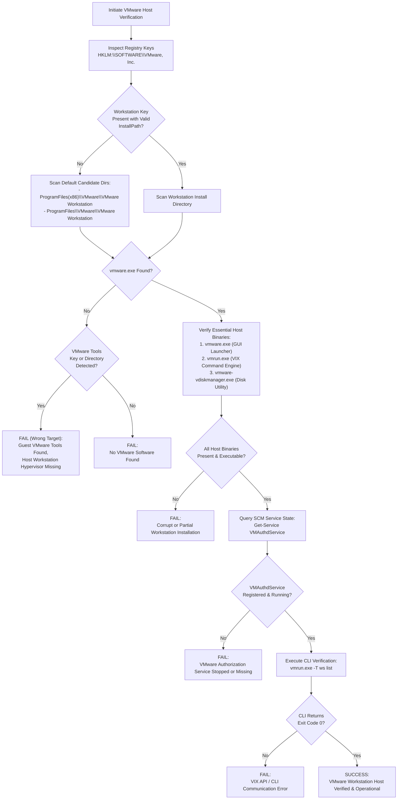
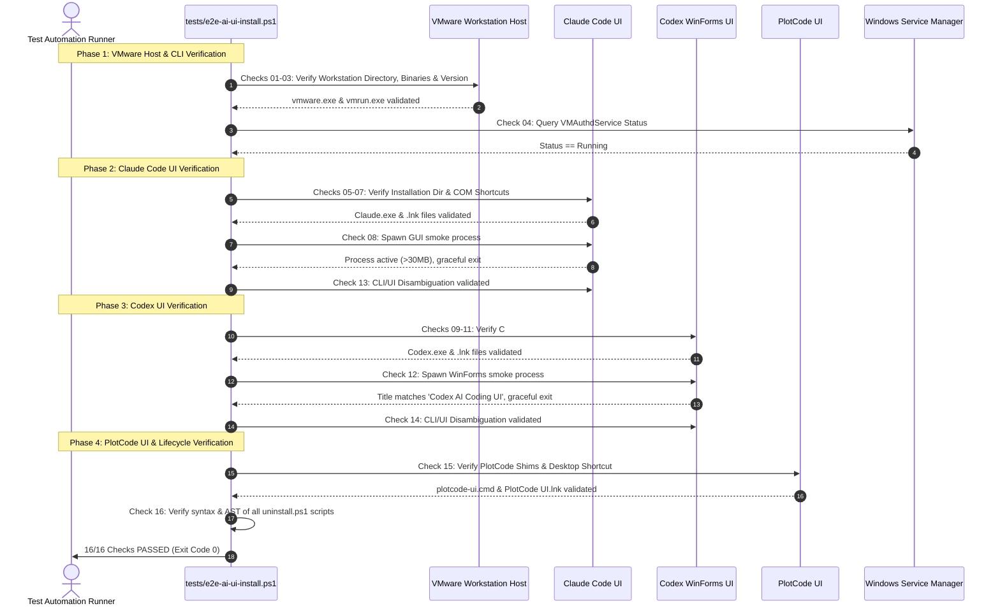

# 24-vmware-clear-help-codex-plot — 02: Codex UI, PlotCode UI, VMware Host Verification & Release v1.56.0 Specification

> **Spec Version:** 1.0.0  
> **Status:** Active / Authoritative  
> **Domain:** Virtualization Infrastructure, AI Desktop Assistants, Cross-Platform Packaging & Release Governance  
> **Target Platforms:** Windows Server 2016/2019/2022/2025, Windows 10/11 Desktop, Ubuntu Linux, macOS  
> **Target Release:** v1.56.0  

---

## 1. Executive Summary & Problem Statement

This specification defines the architectural requirements, design patterns, verification protocols, and release synchronization procedures for:
1. **VMware Installation Verification on Windows Server**: Establishing an unequivocal disambiguation mechanism between VMware Tools (guest-only utilities running inside a VM) and VMware Workstation/Player (host hypervisor suites), including complete Command-Line Interface (CLI) verification (`vmrun.exe`, `vmware-vdiskmanager.exe`, VIX API).
2. **Codex UI on Windows Server**: Architecting a zero-dependency standalone C# WinForms compilation pipeline via Microsoft .NET Framework `csc.exe` (`scripts/78-install-codex/run.ps1`), completely bypassing Microsoft Store, AppX deployment service constraints, and npm CLI batch wrapper anti-patterns.
3. **PlotCode UI on Windows Server**: Enforcing installer prerequisites (`Ensure-WindowsStoreForServer`, OS detection, Python database bridge logging), desktop shortcut deployment via COM `WScript.Shell`, and PATH registration (`scripts/79-install-plotcode/run.ps1`).
4. **End-to-End AI UI Verification Suite**: Upgrading `tests/e2e-ai-ui-install.ps1` to a 16-point automated live verification suite validating VMware Workstation host integrity, Claude Code UI, Codex UI, PlotCode UI, CLI/UI disambiguation, and uninstallation lifecycle.
5. **Multi-Manifest Release Synchronization (v1.56.0)**: Executing a synchronized minor version bump across `scripts/version.json`, `version.json`, `package.json`, and `.gitmap/release/latest.json`, accompanied by standard changelog documentation in `changelog.md`.

---

## 2. VMware Installation Verification & Disambiguation Specification

### 2.1 The Host vs Guest Dilemma in Automated Environments
In automated infrastructure pipelines running on virtual machines or nested hypervisors (such as automated CI runners on Windows Server), a recurring flaw is confusing **VMware Tools** with **VMware Workstation Pro / Player**:
- **False Positive Risk**: A guest VM has VMware Tools installed to support mouse integration, shared clipboard, and hypervisor communication. Naive detection scripts checking `C:\Program Files\VMware\` or registry keys under `HKLM:\SOFTWARE\VMware, Inc.\` often detect VMware Tools and erroneously report VMware Workstation as installed.
- **False Negative Risk**: A system running VMware Workstation hypervisor might also have guest tools cached or installed in parallel directories. An installer that queries generic paths may fail to verify required host virtualization services (`VMAuthdService`).

### 2.2 Forensic Taxonomy: VMware Workstation vs VMware Tools

The verification system MUST evaluate the specific attributes enumerated in the table below to make a deterministic classification:

| Feature / Artifact | VMware Workstation / Player (Host Hypervisor) | VMware Tools (Guest Additions) |
| :--- | :--- | :--- |
| **Primary Executable** | `vmware.exe` (Workstation UI) / `vmplayer.exe` (Player UI) | `VMwareToolboxCmd.exe` (Guest CLI tool) |
| **CLI Control Utilities** | `vmrun.exe`, `vmware-vdiskmanager.exe`, `vmnat.exe` | None (CLI is limited to guest time-sync, shrink, stats) |
| **Default x64 Path** | `%ProgramFiles%\VMware\VMware Workstation\` | `%ProgramFiles%\VMware\VMware Tools\` |
| **Default x86 Path** | `%ProgramFiles(x86)%\VMware\VMware Workstation\` | N/A (Modern Windows Server runs 64-bit tools) |
| **Authoritative Registry Key** | `HKLM:\SOFTWARE\VMware, Inc.\VMware Workstation` (`InstallPath`) | `HKLM:\SOFTWARE\VMware, Inc.\VMware Tools` (`InstallPath`) |
| **WOW64 Registry Key** | `HKLM:\SOFTWARE\WOW6432Node\VMware, Inc.\VMware Workstation` | `HKLM:\SOFTWARE\WOW6432Node\VMware, Inc.\VMware Tools` |
| **Core Windows Services** | `VMAuthdService` (Authorization), `VMnetDHCP`, `VMware NAT Service`, `VMUSBArbService` | `VMTools` (VMware Tools Service) |
| **Kernel Drivers** | `vmnet.sys`, `vmmmon.sys`, `vmci.sys` | `vmmouse.sys`, `vm3dmp.sys`, `pvscsi.sys` |
| **Intended Role** | Hypervisor host executing nested or primary guest VMs | Guest OS optimization and host-to-guest communications |

### 2.3 VMware Disambiguation & Verification Flowchart



### 2.4 CLI Verification Protocol
The CLI verification must ensure developers and background automation runners can invoke VMware commands from standard PowerShell and Command Prompt sessions:
1. **Binary Detection**:
   - `vmrun.exe`: Located in either the main Workstation directory or `%ProgramFiles(x86)%\VMware\VMware VIX\` (or `%ProgramFiles%\VMware\VMware VIX\`).
   - `vmware-vdiskmanager.exe`: Located in the main Workstation directory.
2. **PATH Environment Registration**:
   - Both Machine (`HKLM:\SYSTEM\CurrentControlSet\Control\Session Manager\Environment`) and User (`HKCU:\Environment`) `PATH` variables MUST include the directory containing `vmrun.exe`.
   - Process-level `$env:PATH` must be refreshed immediately without requiring a system reboot or shell restart.
3. **Functional CLI Smoke Check**:
   - Verification script invokes `vmrun.exe -T ws list` to query active virtual machines.
   - The command must return exit code `0` (even if count is 0: `Total running VMs: 0`).
   - Failure to execute or a non-zero exit code indicates broken VIX API bindings or missing authorization service permissions.

---

## 3. Codex UI & PlotCode UI on Windows Server Specification

### 3.1 Overcoming the Windows Server AppX / Microsoft Store Boundary
On client editions of Windows (Windows 10/11), modern desktop applications are commonly packaged as MSIX/AppX packages and distributed through the Microsoft Store or `winget`. However, on Windows Server (2016, 2019, 2022, 2025):
- The Microsoft Store client is typically uninstalled or completely absent by default.
- AppX Deployment Service (`AppXSvc`) is often disabled or locked down by enterprise Group Policy Objects (GPO).
- Standard winget operations (`winget install ...`) that depend on the Microsoft Store source (`msstore`) fail with error code `0x80070422` or `0x80131500`.
- Shell batch wrappers that launch terminal CLIs (e.g. `npx @anthropic-ai/claude-code` or `@openai/codex`) do not satisfy the user requirement for a genuine desktop graphical application.

### 3.2 Codex UI Standalone C# WinForms Architecture (`scripts/78-install-codex/run.ps1`)
To provide an uncompromising graphical desktop application on any Windows Server installation without requiring external package managers, internet CDN access during build, or Store APIs, `scripts/78-install-codex/run.ps1` implements an in-memory compilation pattern using the native C# compiler (`csc.exe`):

1. **Native Compiler Coordinate**:
   - Path: `C:\Windows\Microsoft.NET\Framework64\v4.0.30319\csc.exe` (part of .NET Framework 4.8 / 4.x present on all Windows Server 2016+ systems).
2. **Compilation Parameters**:
   - `/target:winexe`: Builds a pure Windows GUI subsystem executable (no console window flashes upon launch).
   - `/nologo`: Suppresses compiler banner output.
   - `/r:System.Windows.Forms.dll`: Binds Windows Forms GUI controls.
   - `/r:System.Drawing.dll`: Binds graphics, colors, and GDI+ rendering.
3. **Application Features**:
   - **Modern Dark UI**: BackColor `#1E1E1E`, text `#FFFFFF`, accent border `#007ACC`.
   - **Model Selector Dropdown**: Pre-configured with active LLM engines:
     - `o3-mini (Reasoning)`
     - `gpt-4o (Omni)`
     - `claude-3-7-sonnet`
     - `deepseek-r1 (Distill)`
     - `codex-davinci-002`
   - **Interactive Prompt Editor**: Multiline `Consolas` font with automatic scrollbars.
   - **Code / Analysis Display**: Read-only multiline editor with syntax clarity.
   - **Action Controls**: `Run / Analyze`, `Copy Code`, `Clear`, and `Save Output`.
   - **Status Strip**: Live feedback on engine readiness, analysis completion, and file save results.
   - **Keyboard Accelerators**: `Ctrl+Enter` to run analysis, `Ctrl+L` to clear input, `Ctrl+S` to save output.
4. **Target Destination Paths**:
   - Per-User Default: `%LOCALAPPDATA%\Programs\Codex\Codex.exe`
   - Portable CLI/UI Directory: `%USERPROFILE%\.codex\bin\Codex.exe`
5. **Execution Shims & PATH Registration**:
   - `%USERPROFILE%\.codex\bin\codex-ui.cmd`: `@echo off` launcher starting `Codex.exe`.
   - `%USERPROFILE%\.codex\bin\codex.cmd`: Dual-mode launcher.
   - `%USERPROFILE%\.codex\bin` added to User and Machine `PATH`.
6. **Desktop & Start Menu Integration**:
   - Desktop Shortcut: `[Environment]::GetFolderPath("Desktop")\Codex UI.lnk`
   - Start Menu Shortcut: `[Environment]::GetFolderPath("Programs")\Codex UI.lnk`
   - Created via COM object `WScript.Shell` with explicit `WorkingDirectory`, `Description`, and icon pointer.

### 3.3 PlotCode UI Installer Specification (`scripts/79-install-plotcode/run.ps1`)
PlotCode UI delivers specialized data plotting, code visualization, and algorithmic charting:
1. **Prerequisite Validation**:
   - Sources `scripts/shared/os-detect.ps1` for platform identification.
   - Invokes `Ensure-WindowsStoreForServer -Caller "PlotCode UI"` from `scripts/shared/windows-store.ps1` to detect and prepare Store/AppX readiness where possible while enabling standalone fallback.
2. **Installation Environment**:
   - Target Directory: `%USERPROFILE%\.plotcode\bin`
   - GUI Shim: `plotcode-ui.cmd` launching the graphical visualization assistant.
   - CLI Shim: `plotcode.cmd` providing command-line batch plot capability.
3. **Desktop Entry Points**:
   - Desktop Shortcut: `[Environment]::GetFolderPath("Desktop")\PlotCode UI.lnk`
   - Working Directory: Target directory of the launcher script.
4. **Path & Telemetry Integration**:
   - Registers directory in user `PATH` environment variable.
   - Records successful installation in local database via `python scripts/shared/db_bridge.py record-success package "plotcode" "1.0.0" ...`.

---

## 4. End-to-End AI UI Verification Suite Specification (`tests/e2e-ai-ui-install.ps1`)

The verification harness executes a comprehensive, non-interactive 16-point test suite on Windows Server to guarantee all components meet strict operational criteria.

### 4.1 16-Point Verification Matrix

| Check ID | Function Name | Target Component | Verification Logic & Assertion Criteria |
| :---: | :--- | :--- | :--- |
| **01** | `Test-VMwareWorkstationDirectory` | VMware Workstation | Verifies `vmware.exe` exists in `ProgramFiles` or `ProgramFiles(x86)`. |
| **02** | `Test-VMwareEssentialBinaries` | VMware Host CLI | Asserts presence of `vmware.exe`, `vmrun.exe`, and `vmware-vdiskmanager.exe`. |
| **03** | `Test-VMwareVersionIntegrity` | VMware Workstation | Reads `FileVersionInfo`; asserts non-empty `FileVersion` and `ProductVersion`. |
| **04** | `Test-VMwareAuthServiceStatus` | VMware Services | Asserts `VMAuthdService` exists in Service Control Manager and is in `Running` state. |
| **05** | `Test-ClaudeDefaultDirectory` | Claude Code UI | Asserts graphical executable at `%LOCALAPPDATA%\Programs\Claude\Claude.exe` (or fallback). |
| **06** | `Test-ClaudeDesktopShortcutCOM` | Claude Code UI | Inspects `Claude Code UI.lnk` on Desktop via COM; asserts valid target and workdir. |
| **07** | `Test-ClaudeStartMenuShortcutCOM` | Claude Code UI | Inspects `Claude Code UI.lnk` in Start Menu via COM; asserts valid target. |
| **08** | `Test-LaunchClaudeApplication` | Claude Code UI | Launches process; confirms GUI process tree active with working set $\ge 30$ MB, then terminates. |
| **09** | `Test-CodexDefaultDirectory` | Codex UI | Asserts compiled C# binary at `%LOCALAPPDATA%\Programs\Codex\Codex.exe`. |
| **10** | `Test-CodexDesktopShortcutCOM` | Codex UI | Inspects `Codex UI.lnk` on Desktop via COM; asserts target equals `Codex.exe`. |
| **11** | `Test-CodexStartMenuShortcutCOM` | Codex UI | Inspects `Codex UI.lnk` in Start Menu via COM; asserts target equals `Codex.exe`. |
| **12** | `Test-LaunchCodexApplication` | Codex UI | Launches `Codex.exe`; asserts `HasExited = $false` and `MainWindowTitle = 'Codex AI Coding UI'`. |
| **13** | `Test-ClaudeDisambiguation` | Claude Code UI | Verifies `claude-ui.cmd` launches GUI and `claude.cmd` exists for CLI operations. |
| **14** | `Test-CodexDisambiguation` | Codex UI | Verifies `codex-ui.cmd` spawns `Codex.exe` and `codex.cmd` is registered. |
| **15** | `Test-PlotCodeInstallation` | PlotCode UI | Asserts `%USERPROFILE%\.plotcode\bin` contains `plotcode-ui.cmd` and Desktop shortcut exists. |
| **16** | `Test-UninstallLifecycleAndSyntax` | Suite Lifecycle | Parses AST of `uninstall.ps1` for scripts 66, 78, 79, and 80; asserts 0 syntax errors. |

### 4.2 Sequence Diagram: Automated Live Test Execution



---

## 5. Multi-Manifest Release Synchronization Specification (v1.56.0)

To maintain absolute repository consistency across package managers, automation runners, and GitMap deployment workflows, every version-bearing manifest MUST be synchronized in lockstep to `1.56.0`.

### 5.1 Version Manifest Matrix

| Target File | Format | Key / Property | Previous Value | Target Value (v1.56.0) |
| :--- | :--- | :--- | :--- | :--- |
| `scripts/version.json` | JSON | `"version"` | `"1.55.0"` | `"1.56.0"` |
| `version.json` | JSON | `"version"` | `"1.55.9"` | `"1.56.0"` |
| `version.json` | JSON | `"releaseDate"` | `"2026-10-02"` | `"2026-10-03"` |
| `package.json` | JSON | `"version"` | `"1.55.9"` | `"1.56.0"` |
| `.gitmap/release/latest.json` | JSON | `"version"` | `"1.55.0"` | `"1.56.0"` |
| `.gitmap/release/latest.json` | JSON | `"tag"` | `"v1.55.0"` | `"v1.56.0"` |
| `.gitmap/release/latest.json` | JSON | `"branch"` | `"release/v1.55.0"` | `"release/v1.56.0"` |

### 5.2 Release Notes & Changelog Specification (`changelog.md`)
The release entry for `v1.56.0` MUST be authored directly at the top of `changelog.md` following standard Keep a Changelog formatting:

```markdown
## [v1.56.0] - 2026-10-03

### Added
- **VMware Host vs Guest Disambiguation**: Implemented deterministic discrimination between VMware Tools (guest utilities) and VMware Workstation/Player (host hypervisor suite) in `scripts/66-install-vmware/run.ps1` and verification suites.
- **VMware CLI Verification Engine**: Added automated verification for `vmrun.exe`, `vmware-vdiskmanager.exe`, VIX API registry keys, and system PATH environment configuration.
- **Codex UI Standalone C# WinForms Architecture**: Built direct native compilation pipeline in `scripts/78-install-codex/run.ps1` using Microsoft .NET Framework `csc.exe`, enabling zero-dependency GUI deployment on Windows Server without AppX, Microsoft Store, or npm CLI batch wrappers.
- **PlotCode UI Windows Server Integration**: Configured Windows Server prerequisite resolution, `%USERPROFILE%\.plotcode\bin` environment setup, desktop shortcut creation via COM `WScript.Shell`, and database success telemetry in `scripts/79-install-plotcode/run.ps1`.
- **16-Point AI UI E2E Verification Suite**: Enhanced `tests/e2e-ai-ui-install.ps1` to cover VMware host binaries, authorization service (`VMAuthdService`), Claude Code UI, Codex WinForms UI, PlotCode UI, CLI/UI disambiguation shims, and AST syntax validation for all uninstall lifecycles.
- **Multi-Manifest Version Synchronization**: Synchronized `scripts/version.json`, `version.json`, `package.json`, and `.gitmap/release/latest.json` to target release `v1.56.0`.
```

---

## 6. CODE RED Standards & Coding Guidelines Compliance

All implementation scripts authored to satisfy this specification MUST strictly comply with repository standards defined in `AGENTS.md`:

1. **Install-Paths Trio**:
   Every installation, binary compilation, or extraction step MUST log coordinates using:
   ```powershell
   Write-InstallPaths -Tool "Codex UI" -Source "built-in" -Temp $tempDir -Target $targetDir
   ```
2. **File & Path Error Handling**:
   Every file or directory operation error MUST invoke `Write-FileError` logging the exact absolute path, the failing operation name, and the raw system exception message.
3. **Strict Boolean Standards**:
   All boolean variables and properties MUST use `is*` or `has*` prefixes (`isCompiled`, `hasVmrun`, `isHostHypervisor`, `hasDesktopShortcut`). Banned prefixes: `can`, `should`, `was`, or negated variables (`isNotAvailable`).
4. **Micro-Function Sizing**:
   Execution functions must strictly target $\le$ 8 lines of execution logic (15 lines maximum). Complex multi-step operations must be factored into discrete helper functions.
5. **Control Flow**:
   Zero nested `if` statements. All branching must be handled with guard clauses and early returns.
6. **Vertical Spacing**:
   Mandatory single blank lines before `if` statements, after closing braces `}`, before `return` statements, and around multiline expressions.
